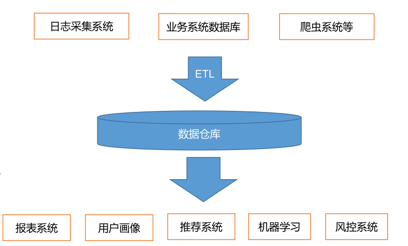
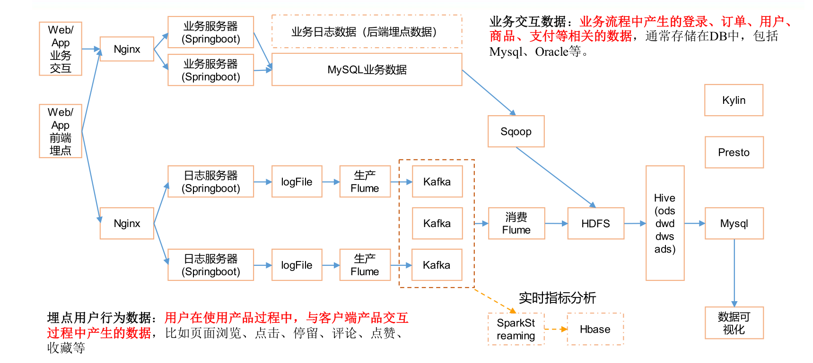
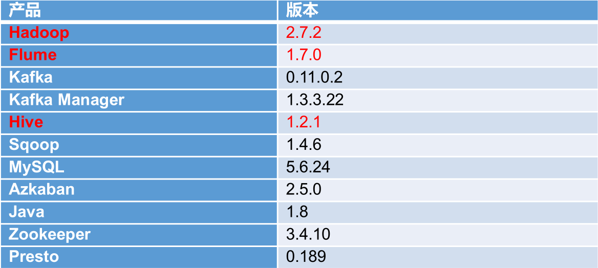
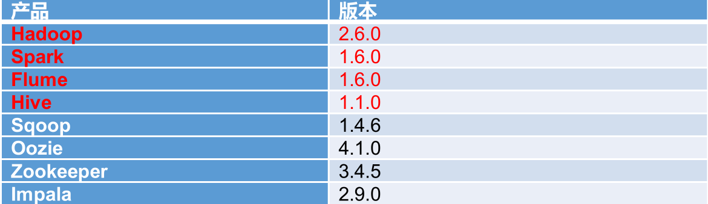
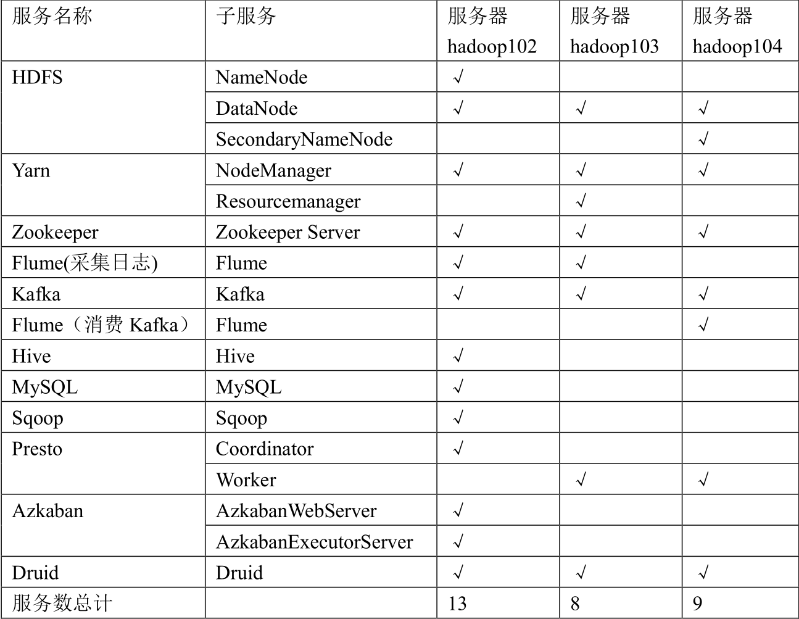
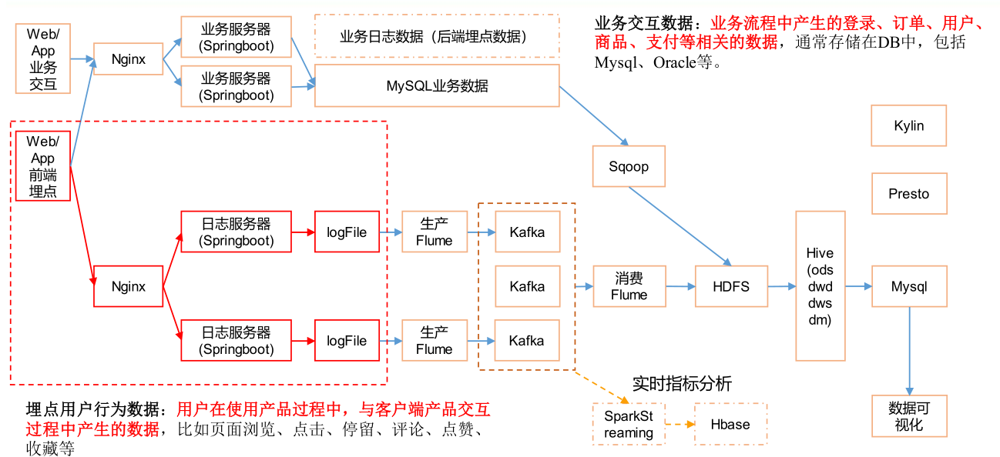

# 一、数据采集
## 1.1 数据仓库介绍

<div align="center">  </div>

### 1.1.1 数据采集【来源】
* 埋点用户行为数据：用户在使用产品过程中，与客户端产品交互过程中产生的数据用户在使用产品过程中，与客户端产品交互过程中产生的数据，比如页面浏览、点击、停留、评论、点赞、收藏等
* 业务交互数据：业务流程中产生的登录、订单、用户、商品、支付等相关的数据业务流程中产生的登录、订单、用户、商品、支付等相关的数据，通常存储在DB中，包括Mysql、Oracle等。
* 日志采集系统：记录用户来到该网站，停留多长时间，生成了哪些关键字，喜好等用户浏览行为【通过埋点实现】，这些数据用户日后系统分析用户，建立用户画像等做准备；数据存放于服务器的日志文件中【数据量大】
* 业务系统数据库：保证电商网站正常运行，满足用户支付、订单等业务的执行，数据【业务交互数据】保存到mysql中
* 爬虫系统：大公司分析竞争对手；小公司爬虫为了前期数据铺垫

### 1.1.2 ETL
* 负责将各种数据进行清洗，提取

### 1.1.3 数据仓库
* 数据仓库（ Data Warehouse ），是**<font color=red size=3.5>为企业所有决策制定过程，提供所有系统数据支持的战略集合</font>**。
* 通过对数据仓库中数据的分析，可以帮助企业，**<font color=red size=3.5>改进业务流程、控制成本、提高产品质量</font>**等。
* 数据仓库，并不是数据的最终目的地，而是为数据最终的目的地做好准备。这些准备包括对数据的：**<font color=red size=3.5>【进一步】清洗，转义，分类，重组，合并，拆分，统计</font>**等等。

### 1.1.4 数据分析【目的地】
* 报表系统、用户画像、推荐系统、机器学习、风控系统

# 二、项目需求及架构设计
## 2.1 概念理解
### 2.1.1 留存率
* 留存率=新增用户中登录用户数/新增用户数*100%（一般统计周期为天）
* 新增用户数：在某个时间段（一般为第一整天）新登录应用的用户数；
* 登录用户数：登录应用后至当前时间，至少登录过一次的用户数；
* 次日留存率：（当天新增的用户中，在注册的第2天还登录的用户数）/第一天新增总用户数；
* 第3日留存率：（第一天新增用户中，在注册的第3天还有登录的用户数）/第一天新增总用户数；
* 第7日留存率：（第一天新增的用户中，在注册的第7天还有登录的用户数）/第一天新增总用户数；
* 第30日留存率：（第一天新增的用户中，在注册的第30天还有登录的用户数）/第一天新增总用户数。

### 2.1.2 转换率
来自百度百科：https://baike.baidu.com/item/%E7%BD%91%E7%AB%99%E8%BD%AC%E5%8C%96%E7%8E%87<br>
网站转化率（conversion rate）是指用户进行了相应目标行动的访问次数与总访问次数的比率。相应的行动可以是用户登录、用户注册、用户订阅、用户下载、用户购买等一系列用户行为，因此网站转化率是一个广义的概念。简而言之，就是当访客访问网站的时候，把访客转化成网站常驻用户，也可以理解为访客到用户的转换。<br>
以用户登录为例，如果每100次访问中，就有10个登录网站，那么此网站的登录转化率就为10%，而最后有2个用户订阅，则订阅转化率为2%，有一个用户下订单购买，则购买转化率为1%。很多人将网站转化率仅仅定义为注册转化率或者订单转换率，这都是狭义的网站转化率概念。要全面理解网站转化率的概念。<br>
网站建设核心关键是“如何寻找潜在客户并有效的转化为合作客户”，这里提到有效的转换也就是说需找到客户但是客户不一定会与选中我们的服务或者产品。网站转化率的高低直接影响着网站销售的效果，在某种意义上假设网站转化率过低，其结果必将造成提高网络营销成本的弊端。有时网站运营者还在纳闷，为什么网站有流量却无销售？这是很多网站存在的共同问题，其根源问题是网站的内容、结构、等使得网站转化率过低。在根源问题没有解决时，却一味的设想怎么实施网站推广计划，这是很多企业网络运营人员或站长朋友们常犯的一个错误。<br>
网站转化率越高，网站盈利能力越强，单位来访者产生的客户越多；提高网站转化率能够在无法增加流量的情况下增加网站的盈利，所以网站转化率是我们必须关注的指标。<br>
另外，重视和研究网站转化率，可以针对性的分析网站在哪些方面做的不足，哪些广告投放效果比较好，可以迅速的提升用户体验、节约广告成本，提升网络转化过程。<br>

### 2.1.3 复购率
指消费者对该品牌产品或者服务的重复购买次数，重复购买率越多，则反应出消费者对品牌的忠诚度就越高，反之则越低。<br>
重复购买率有两种计算方法：一种是所有购买过产品的顾客，以每个人人为独立单位重复购买产品的次数，比如有10个客户购买了产品，5个产生了重复购买，则重复购买率为50%；第二种，按交易计算，即重复购买交易次数与总交易次数的比值，如某月内，一共产生了100笔交易，其中有20个人有了二次购买，这20人中的10个人又有了三次购买，则重复购买次数为30次，重复购买率为30%。推荐企业采取第一种算法。<br>
## 2.2 项目需求分析
### 2.2.1 项目需求
* 数据**<font color=red size=3.5>采集平台搭建</font>**
* 实现**<font color=red size=3.5>用户行为数据仓库的分层</font>**搭建【对日志行为进行分析，如分析用户特点，状态、包括数仓的其他指标】
* 实现**<font color=red size=3.5>业务数据仓库的分层</font>**搭建【从mysql中数据导入，从业务数据提炼分析指标】
* 针对数据仓库中的数据进行，**<font color=red size=3.5>留存【】、转化率、GMV、复购率、活跃</font>**等**<font color=red size=3.5>报表分析</font>**

### 2.2.2 思考题
* 项目技术如何选型？
* 框架版本如何选型（Apache、CDH、HDP）
* 服务器使用物理机还是云主机？
* 如何确认集群规模？（假设每台服务器8T硬盘

## 2.3 项目框架
### 2.3.1 技术选型【两套方案，红黑】
* 数据采集传输：**<font color=red size=3.5>Flume【日志文件file采集】，Kafka【用于分类，消费数据】，Sqoop【业务数据库mysql采集】</font>** ，Logstash【ELK框架】，DataX【类似于Sqoop】，
* 数据存储：**<font color=red size=3.5>MySql【增删改查，存储分析后的指标数据】，HDFS</font>**，HBase，Redis，MongoDB【存储爬虫爬到的数据】
* 数据计算：**<font color=red size=3.5>Hive，Tez， Spark</font>**， Flink【第三代大数据分析引擎】，Storm
* 数据查询：**<font color=red size=3.5>Presto，Druid</font>** ，Impala，Kylin

### 2.3.2 系统数据流程设计
<div align="center">  </div>

* 网站不同数据通过nginx【负载均衡】分布到不同的服务器上【数据解耦】
* hdfs上的数据导入到hive数据仓库中，hive分析后的数据再导入到mysql中
* kylin和presto是查询hive当中的数据
* Druid也可以在kafka中做实时查询

### 2.3.3 框架版本选型
* 如何选择Apache/CDH/HDP版本？<br>
（1）Apache：**<font color=red size=3.5>运维麻烦，组件间兼容性需要自己调研</font>**。（一般大厂使用，技术实力雄厚，有专业的运维人员）<br>
（2）CDH：国内使用最多的版本，但CM不开源，但其实**<font color=red size=3.5>对中、小公司使用来说没有影响 （建议使用 ）</font>**<br>
（3）HDP：开源，可以进行二次开发，但是**<font color=red size=3.5>没有CDH稳定，国内使用较少</font>**<br>
（4）注意事项：**<font color=red size=3.5>框架选型尽量不要选择最新的框架，选择最新框架半年前左右的稳定版。</font>**

* Apache框架版本

<div align="center">  </div>

* CDH框架版本：5.12.1

<div align="center">  </div>
### 2.3.4 服务器选型
**<font color=red size=4>服务器选择物理机还是云主机？</font>**

*  机器成本考虑：<br>
**<font color=red size=3.5>物理机</font>**：以128G内存，20核物理CPU，40线程，8THDD和2TSSD硬盘，戴尔品牌**<font color=red size=3.5>单台报价4W出头</font>**，需考虑托管服务器费用。**<font color=red size=3.5>一般物理机寿命5年左右</font>**【双电源或单电源，YPS电源】<br>
**<font color=red size=3.5>云主机</font>**，以阿里云为例，差不多相同配置，**<font color=red size=3.5>每年5W</font>**

* 运维成本考虑：<br>
**<font color=red size=3.5>物理机</font>**：需要有**<font color=red size=3.5>专业的运维人员</font>**<br>
**<font color=red size=3.5>云主机</font>**：很多运维工作都由**<font color=red size=3.5>阿里云完成</font>**，运维相对较轻松
### 2.3.5 集群资源规划设计
* 如何确认集群规模？（假设：每台服务器8T磁盘，128G内存）<br>
（1）每天日活跃用户100万，每人一天平均100条：**<font color=red size=3.5>100万*100条=10000万条</font>**<br>
（2）每条日志1K左右，每天1亿条：**<font color=red size=3.5>100000000 / 1024 / 1024 = 约100G</font>**
（3）半年内不扩容服务器来算：**<font color=red size=3.5>100G*180天=约18T</font>**<br>
（4）保存3副本：**<font color=red size=3.5>18T*3=54T</font>**<br>
（5）预留20%~30%Buf=**<font color=red size=3.5>54T/0.7=77T</font>**<br>
（6）算到这：约**<font color=red size=3.5>8T*10台服务器</font>**<br>

* 如果考虑数仓分层？<br>
服务器将近再扩容1-2倍，讲完数仓后详解

* 测试集群服务器规划<br>

在实际工作中，需要有生产集群和测试集群，一般测试集群三台即可【原则：耗内存的服务分开】<br>
服务器hadoop102:8G；服务器hadoop103:4G；服务器hadoop104:4G

<div align="center">  </div>

* HDFS：NameNode和SecondaryNameNode分开存放
* Yarn：ResourceManager单独放
* Flume：采集的Flume和消费Kafka的Flume分开存放

# 三、数据生成模块
## 3.1 埋点数据基本格式
* 公共字段：基本所有安卓手机都包含的字段
* 业务字段：埋点上报的字段，有具体的业务类型

**<font color=red size=4>业务字段的上传示例：</font>**

```json
{
"ap":"xxxxx",//项目数据来源 app pc
"cm": { //公共字段
        "mid": "", // (String) 设备唯一标识
        "uid": "", // (String) 用户标识
        "vc": "1", // (String) versionCode，程序版本号
        "vn": "1.0", // (String) versionName，程序版本名
        "l": "zh", // (String) 系统语言
        "sr": "", // (String) 渠道号，应用从哪个渠道来的。
        "os": "7.1.1", // (String) Android 系统版本
        "ar": "CN", // (String) 区域
        "md": "BBB100-1", // (String) 手机型号
        "ba": "blackberry", // (String) 手机品牌
        "sv": "V2.2.1", // (String) sdkVersion
        "g": "", // (String) gmail
        "hw": "1620x1080", // (String) heightXwidth，屏幕宽高
        "t": "1506047606608", // (String) 客户端日志产生时的时间
        "nw": "WIFI", // (String) 网络模式
        "ln": 0, // (double) lng 经度
        "la": 0 // (double) lat 纬度
	},
"et": [ //事件
            {
                "ett": "1506047605364", //客户端事件产生时间
                "en": "display", //事件名称【对应各种事件】
                "kv": { //事件结果，以 key-value 形式自行定义
                "goodsid": "236",
                "action": "1",
                "extend1": "1",
                "place": "2",
                "category": "75"
        		}
        	}
    	]
}
```

**<font color=red size=4>示例日志（服务器时间戳 | 日志）：</font>**

```json
1540934156385|{
    "ap": "gmall",//这个可以分为PC端和app端
    "cm": {
        "uid": "1234",
        "vc": "2",
        "vn": "1.0",
        "la": "EN",
        "sr": "",
        "os": "7.1.1",
        "ar": "CN",
        "md": "BBB100-1",
        "ba": "blackberry",
        "sv": "V2.2.1",
        "g": "abc@gmail.com",
        "hw": "1620x1080",
        "t": "1506047606608",
        "nw": "WIFI",
        "ln": 0
		},
        "et": [
                {
                    "ett": "1506047605364", //客户端事件产生时间
                    "en": "display", //事件名称
                    "kv": { //事件结果，以 key-value 形式自行定义
                    "goodsid": "236",
                    "action": "1",
                    "extend1": "1",
                    "place": "2",
                    "category": "75"
                    }
                },
                {
                    "ett": "1552352626835",
                    "en": "active_background",
                    "kv": {
                    "active_source": "1"
                    }
                }
			]
}
```
## 3.2 事件日志数据
### 3.2.1  商品列表页(loading)
**<font color=red size=4>事件名称：loading</font>**<br>

<table>
    <thead>
        <tr>
            <th>标签</th>
            <th>含义</th>
        </tr>
    </thead>
    <tbody>
        <tr>
            <th>action</th>
            <th>动作：开始加载=1，加载成功=2，加载失败=3</th>
        </tr>
        <tr>
            <th>loading_time</th>
            <th>加载时长：计算下拉开始到接口返回数据的时间，（开始加载报 0 ，加载成功或加载失败才上报时间）</th>
        </tr>
        <tr>
            <th>loading_way</th>
            <th>加载类型：1-读取缓存，2-从接口拉新数据
（加载成功才上报加载类型）</th>
        </tr>
        <tr>
            <th>extend1</th>
            <th>扩展字段 Extend1【产品需求增加字段预先保留的空字段】</th>
        </tr>
        <tr>
            <th>extend2</th>
            <th>扩展字段 Extend2</th>
        </tr>
        <tr>
            <th>type</th>
            <th>加载类型：自动加载=1 ，用户下拽加载=2 ，底部加载=3 （底部条触发点击底部提示条/</th>
        </tr>
        <tr>
            <th>type1</th>
            <th>加载失败码：把加载失败状态码报回来（报空为加载成功，没有失败）</th>
        </tr>
    </tbody>
</table>

### 3.2.2  商品 点击(display)
**<font color=red size=4>事件名称：display</font>**<br>

<table>
    <thead>
        <tr>
            <th>标签</th>
            <th>含义</th>
        </tr>
    </thead>
    <tbody>
        <tr>
            <th>action</th>
            <th>动作：曝光商品=1，点击商品=2，</th>
        </tr>
        <tr>
            <th>goodsid</th>
            <th>商品 ID（服务端下发的 ID）</th>
        </tr>
        <tr>
            <th>place</th>
            <th>顺序（第几条商品，第一条为 0，第二条为 1，如此类推）</th>
        </tr>
        <tr>
            <th>extend1</th>
            <th>曝光类型：1 - 首次曝光 2-重复曝光</th>
        </tr>
        <tr>
            <th>category</th>
            <th>分类 ID（服务端定义的分类 ID）</th>
        </tr>
    </tbody>
</table>

### 3.2.3  商品 详情页(newsdetail)
**<font color=red size=4>事件名称：newsdetail</font>**<br>

<table>
    <thead>
        <tr>
            <th>标签</th>
            <th>含义</th>
        </tr>
    </thead>
    <tbody>
        <tr>
            <th>entry</th>
            <th>页面入口来源：应用首页=1、push=2、详情页相关推荐=3</th>
        </tr>
        <tr>
            <th>action</th>
            <th>动作：开始加载=1，加载成功=2（pv），加载失败=3, 退出页面=4</th>
        </tr>
        <tr>
            <th>goodsid</th>
            <th>商品 ID（服务端下发的 ID）</th>
        </tr>
        <tr>
            <th>show_style</th>
            <th>商品样式：0、无图、1、一张大图、2、两张图、3、三张小图、4、一张小图、5、一张大图两张小图</th>
        </tr>
        <tr>
            <th>news_staytime</th>
            <th>页面停留时长：从商品开始加载时开始计算，到用户关闭页面所用的时间。若中途用跳转到其它页面了，则暂停计时，待回到详情页时恢复计时。或中途划出的时间超过 10 分钟，则本次计时作废，不上报本次数据。如未加载成功退出，则报空。</th>
        </tr>
        <tr>
            <th>loading_time</th>
            <th>加载时长：计算页面开始加载到接口返回数据的时间 （开始加载报 0，加载成功或加载失败才上报时间）</th>
        </tr>
        <tr>
            <th>type1</th>
            <th>加载失败码：把加载失败状态码报回来（报空为加载成功，没有失败）</th>
        </tr>
        <tr>
            <th>category</th>
            <th>分类 ID（服务端定义的分类 ID）</th>
        </tr>
    </tbody>
</table>

### 3.2.4  广告(ad)
**<font color=red size=4>事件名称：ad</font>**<br>

<table>
    <thead>
        <tr>
            <th>标签</th>
            <th>含义</th>
        </tr>
    </thead>
    <tbody>
        <tr>
            <th>entry</th>
            <th>入口：商品列表页=1 应用首页=2 商品详情页=3</th>
        </tr>
        <tr>
            <th>action</th>
            <th>动作：请求广告=1 取缓存广告=2 广告位展示=3 广告展示=4 广告点击=5</th>
        </tr>
        <tr>
            <th>content</th>
            <th>状态：成功=1 失败=2</th>
        </tr>
        <tr>
            <th>detail</th>
            <th>失败码（没有则上报空）</th>
        </tr>
        <tr>
            <th>source</th>
            <th>广告来源:admob=1 facebook=2 ADX（百度）=3 VK（俄罗斯）=4</th>
        </tr>
        <tr>
            <th>behavior</th>
            <th>用户行为：主动获取广告=1；被动获取广告=2</th>
        </tr>
        <tr>
            <th>newstype</th>
            <th>Type: 1- 图文 2-图集 3-段子 4-GIF 5-视频 6-调查 7-纯文 8-视频+图文 9-GIF+图文 0-其他</th>
        </tr>
        <tr>
            <th>show_style</th>
            <th>内容样式：无图(纯文字)=6， 一张大图=1， 三张小图+文=4， 一张小图=2， 一张大图两张小图+文=3 ，图集+文 = 5，一张大图+文=11， GIF 大图+文=12， 视频(大图)+文 = 13，来源于详情页相关推荐的商品，上报样式都为 0（因为都是左文右图）</th>
        </tr>
    </tbody>
</table>

### 3.2.5  消息通知(notification)
**<font color=red size=4>事件名称：notification</font>**<br>

<table>
    <thead>
        <tr>
            <th>标签</th>
            <th>含义</th>
        </tr>
    </thead>
    <tbody>
        <tr>
            <th>action</th>
            <th>动作：通知产生=1，通知弹出=2，通知点击=3，常驻通知展示（不重复上报，一天之内只报一次）=4</th>
        </tr>
        <tr>
            <th>type</th>
            <th>通知 id：预警通知=1，天气预报（早=2，晚=3），常驻=4</th>
        </tr>
        <tr>
            <th>ap_time</th>
            <th>客户端弹出时间</th>
        </tr>
        <tr>
            <th>content</th>
            <th>备用字段</th>
        </tr>
    </tbody>
</table>

### 3.2.6  用户前台活跃(active_foreground)
**<font color=red size=4>事件名称：active_foreground</font>**<br>

<table>
    <thead>
        <tr>
            <th>标签</th>
            <th>含义</th>
        </tr>
    </thead>
    <tbody>
        <tr>
            <th>push_id</th>
            <th>推送的消息的 id，如果不是从推送消息打开，传空</th>
        </tr>
        <tr>
            <th>access</th>
            <th>1.push 2.icon 3.其他</th>
        </tr>
    </tbody>
</table>

### 3.2.7  用户 后台 活跃(active_background)
**<font color=red size=4>事件名称：active_background</font>**<br>

<table>
    <thead>
        <tr>
            <th>标签</th>
            <th>含义</th>
        </tr>
    </thead>
    <tbody>
        <tr>
            <th>active_source</th>
            <th>1=upgrade,2=download(下载),3=plugin_upgrade</th>
        </tr>
    </tbody>
</table>

### 3.2.8  评论（ comment）
**<font color=red size=4>描述：评论表</font>**<br>

<table>
    <thead>
        <tr>
            <th>序号</th>
            <th>字段名称</th>
            <th>字段描述</th>
            <th>字段类型</th>
            <th>长度</th>
            <th>允许空</th>
            <th>缺省值</th>
        </tr>
    </thead>
    <tbody>
        <tr>
            <th>1</th>
            <th>comment_id</th>
            <th>评论表</th>
            <th>int</th>
            <th>10,0</th>
            <th></th>
            <th></th>
        </tr>
        <tr>
            <th>2</th>
            <th>userid</th>
            <th>用户 id </th>
            <th>int</th>
            <th>10,0</th>
            <th>√</th>
            <th>0</th>
        </tr>
        <tr>
            <th>3</th>
            <th>p_comment_id</th>
            <th>父级评论 id(为 0 则是一级评论,不为 0 则是回复)</th>
            <th>int</th>
            <th>10,0</th>
            <th>√</th>
            <th></th>
        </tr>
        <tr>
            <th>4</th>
            <th>content</th>
            <th>评论内容 </th>
            <th>string</th>
            <th>1000</th>
            <th>√</th>
            <th></th>
        </tr>
        <tr>
            <th>5</th>
            <th>addtime</th>
            <th>创建时间</th>
            <th>string</th>
            <th></th>
            <th>√</th>
            <th></th>
        </tr>
        <tr>
            <th>6</th>
            <th>other_id</th>
            <th>评论的相关 id </th>
            <th>int</th>
            <th>10,0</th>
            <th>√</th>
            <th></th>
        </tr>
        <tr>
            <th>7</th>
            <th>praise_count</th>
            <th>点赞数量 </th>
            <th>int</th>
            <th>10,0</th>
            <th>√</th>
            <th>0</th>
        </tr>
        <tr>
            <th>8</th>
            <th>reply_count</th>
            <th>回复数量 </th>
            <th>int</th>
            <th>10,0</th>
            <th>√</th>
            <th>0</th>
        </tr>
    </tbody>
</table>

### 3.2.9  收藏（ （favorites ）
**<font color=red size=4>描述：收藏</font>**<br>

<table>
    <thead>
        <tr>
            <th>序号</th>
            <th>字段名称</th>
            <th>字段描述</th>
            <th>字段类型</th>
            <th>长度</th>
            <th>允许空</th>
            <th>缺省值</th>
        </tr>
    </thead>
    <tbody>
        <tr>
            <th>1</th>
            <th>id</th>
            <th>主键</th>
            <th>int</th>
            <th>10,0</th>
            <th></th>
            <th></th>
        </tr>
        <tr>
            <th>2</th>
            <th>course_id</th>
            <th>商品 id</th>
            <th>int</th>
            <th>10,0</th>
            <th>√</th>
            <th>0</th>
        </tr>
        <tr>
            <th>3</th>
            <th>userid</th>
            <th>用户 ID</th>
            <th>int</th>
            <th>10,0</th>
            <th>√</th>
            <th>0</th>
        </tr>
        <tr>
            <th>4</th>
            <th>add_time</th>
            <th>创建时间</th>
            <th>string</th>
            <th></th>
            <th>√</th>
            <th></th>
        </tr>
    </tbody>
</table>

### 3.2.10  点赞（ （praise ）
**<font color=red size=4>描述：所有的点赞表</font>**<br>

<table>
    <thead>
        <tr>
            <th>序号</th>
            <th>字段名称</th>
            <th>字段描述</th>
            <th>字段类型</th>
            <th>长度</th>
            <th>允许空</th>
            <th>缺省值</th>
        </tr>
    </thead>
    <tbody>
        <tr>
            <th>1</th>
            <th>id</th>
            <th>主键 id</th>
            <th>int</th>
            <th>10,0</th>
            <th></th>
            <th></th>
        </tr>
        <tr>
            <th>2</th>
            <th>userid</th>
            <th>用户 id</th>
            <th>int</th>
            <th>10,0</th>
            <th>√</th>
            <th></th>
        </tr>
        <tr>
            <th>3</th>
            <th>target_id</th>
            <th>点赞的对象 id</th>
            <th>int</th>
            <th>10,0</th>
            <th>√</th>
            <th></th>
        </tr>
        <tr>
            <th>4</th>
            <th>type</th>
            <th>点赞类型 ：1 ：问答点赞； 2： 问答评论点赞； 3 ：文章点赞数； 4： 评论点赞</th>
            <th>int</th>
            <th>10,0</th>
            <th>√</th>
            <th></th>
        </tr>
        <tr>
            <th>5</th>
            <th>add_time</th>
            <th>添加时间</th>
            <th>string</th>
            <th></th>
            <th>√</th>
            <th></th>
        </tr>
    </tbody>
</table>

### 3.2.11 错误日志

<table>
    <tbody>
        <tr>
            <th>errorBrief</th>
            <th>错误摘要</th>
        </tr>
        <tr>
            <th>errorDetail</th>
            <th>错误详情</th>
        </tr>
    </tbody>
</table>

## 3.3 启动日志数据
事件标签: start action=1 可以算成前台活跃

<table>
    <thead>
        <tr>
            <th>标签</th>
            <th>含义</th>
        </tr>
    </thead>
    <tbody>
        <tr>
            <th>entry</th>
            <th>入 口 ：  push=1 ， widget=2 ， icon=3 ， notification=4,lockscreen_widget =5</th>
        </tr>
        <tr>
            <th>open_ad_type</th>
            <th>开屏广告类型: 开屏原生广告=1, 开屏插屏广告=2</th>
        </tr>
        <tr>
            <th>action</th>
            <th>状态：成功=1 失败=2</th>
        </tr>
        <tr>
            <th>loading_time</th>
            <th>加载时长：计算下拉开始到接口返回数据的时间，（开始加载报 0，加载成功或加载失败才上报时间）</th>
        </tr>
        <tr>
            <th>detail</th>
            <th>失败码（没有则上报空）</th>
        </tr>
        <tr>
            <th>extend1</th>
            <th>失败的 message（没有则上报空）</th>
        </tr>
        <tr>
            <th ><font color=red size=4>en</font></th>
            <th><font color=red size=4>日志类型 start</font></th>
        </tr>
    </tbody>
</table>

## 3.4  数据生成 脚本

<div align="center">  </div>

**<font color=black size=4>图中虚线红框中是本节介绍的数据生成的实现</font>**

# 四、数据采集模块


<div align="center">  </div>
<div align="center">  </div>

<div align="center">  </div>

参考地址：[条件概率，全概率，贝叶斯公式理解](https://www.jianshu.com/p/c59851b1c0f3)
强调模板：**<font color=red size=4>强调部分</font>**
github图片存放：<div align="center">  </div>
本地图片存放：<div align="center">  </div>
公式图片：
公式编辑：
空格：&nbsp; &nbsp;

