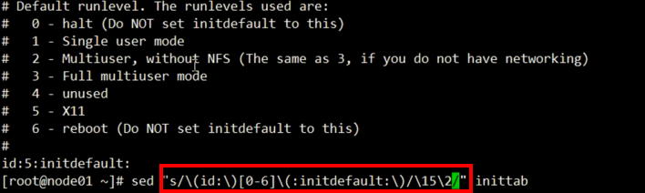
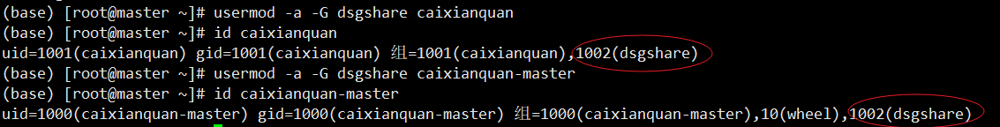
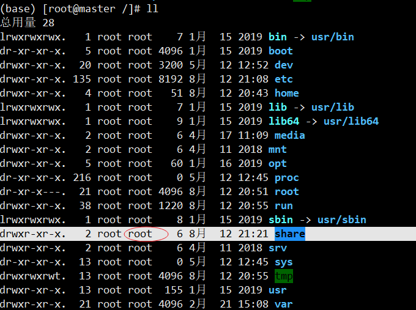
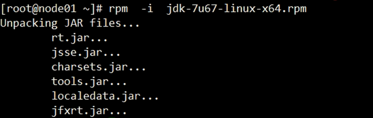

# 一、shell bash
* type：命令类型
  外部命令  &  内部命令
* **<font color="#DC143C" size=4>help</font>**：内部命令帮助
	* help：内部命令清单，附带语法格式，描述
	* help 具体内部命令
* **<font color=red size=4>man</font>**：帮助手册manual
* yum install man man-pages -y
* whereis : 定位命令位置
* file：文件类型
* echo：打印到标准输出
* \$PATH： 环境变量：路径
* $LANG
* **<font color=red size=4>/etc/profile  》  bash启动（交互方式）</font>**
## 1、man
* 1：用户命令(/bin, /usr/bin, /usr/local/bin)
* 2：系统调用
* 3：库用户
* 4：特殊文件(设备文件)
* 5：文件格式(配置文件的语法)
* 6：游戏
* 7：杂项(Miscellaneous)
* 8: 管理命令(/sbin, /usr/sbin, /usr/local/sbin)

# 二、linux介绍
## 2.1 linux操作系统的简单应用
### 2.1.1 linux的文本模式介绍
[root@localhost ~]
* 第一列 root 代表当前用户
* 第二列 localhost 代表主机名
* 第三列~代表当前所在的目录 ~家目录home 目录<br>
linux 的命令可以补全 可以不全目录和文件名，如果不能补全双击 tab键可以显示出要选择的命令

### 2.1.2 linux的登陆与登出
* login 登入系统
* logout 登出系统
* exit 注销当前用户
* clear 清屏命令

### 2.1.3 linux的关机
* shutdown 关机命令
* shutdown now 立即进入维护模式
* halt 直接关机
* shutdown -h now 立即关机
* shutdown -r now 立即重新启动计算机
* shutdown -h 20:00& 20:00 关闭计算机
* shutdown -r 20:00& 20:00 重新启动计算机
* shutdown -k 3 warning:system will shutdown! 只是发送消息给所以用户3 分钟后进入维护模式
* shutdown +3 "system will shutdown after 3 minutes!" 发送消息给所以用户3 分钟后进入系统维
护模式

### 2.1.4 linux的 Init 进程
Init 是 Linux 操作系统中不可缺少的程序之一。init进程是 Linux内核引导运行的，是系统中的第一
个进程，其进程号（PID）永远为1。

* #0 停机(千万不能把initdefault 设置为 0)
* #1 单用户模式
* #2 多用户，没有 NFS(和级别3 相似，会停止部分服务)
* #3 完全多用户模式
* #4 没有用到
* #5 x11(Xwindow)
* #6 重新启动(千万不要把initdefault 设置为 6)

### 2.1.5 查看linux 系统信息
* hostname 显示主机名
* hostname eduask 修改主机名为eduask
* uname 显示系统及版本信息
* -a 显示系统及版本的所有信息
* -s 显示内核名称
* -n 显示网络节点名称（完整的计算机名称）
* -r 显示内核发行版本
* -v 显示内核版本信息
* -m 显示计算机类型
* -o 显示操作系统的类型
* --version 显示系统发行版本信息
* --help 系统命令的帮助信息和参数含义
* cat /proc/version 查看内核版本
* cat /etc/redhat-release 查看redhat发行版本

### 2.1.6 linux下查看用户信息
* whoami &nbsp; &nbsp; 显示当前用户
* who &nbsp; &nbsp; 当前系统所登陆的用户，以及所登录的控制台
* w &nbsp; &nbsp; 当前系统所登陆的用户，以及所登录的控制台的详细信息

# 三、linux的常用命令
## 3.1 比较杂
### 3.1.1 改变目录 cd
目录的表达方法

* /&nbsp; &nbsp;根目录
* .&nbsp; &nbsp;当前目录
* .. &nbsp; &nbsp;上一级目录
* ~&nbsp; &nbsp;家目录
* #cd / &nbsp; &nbsp;进入到系统根目录
* #cd . &nbsp; &nbsp;进入当前目录
* #cd .. &nbsp; &nbsp;进入当前目录的父目录，返回上层目录
* #cd /tmp &nbsp; &nbsp;进入指定目录/tmp
* #cd ~ &nbsp; &nbsp;进入当前用户的家目录
* #cd &nbsp; &nbsp;进入当前用户的家目录
* #cd - &nbsp; &nbsp;回到刚才所在的目录
* #cd ~god &nbsp; &nbsp;进入god目录【god是一个用户的家目录，在home目录下，只有root才能操作该命令】

### 3.1.2 显示当前所在目录 pwd
* pwd &nbsp; &nbsp;显示当前所在目录的路径

### 3.1.3 显示文件或目录的属性 ls （dir）

* #dir &nbsp; &nbsp;显示当前目录的内容（无颜色）
* #ls &nbsp; &nbsp;显示当前目录的内容(有颜色)
* #ls /tmp &nbsp; &nbsp;显示指定目录/tmp的内容
* #ls -l &nbsp; &nbsp;列出文件和文件夹的基本属性和详细信息
* #ll &nbsp; &nbsp;列出文件和文件夹的基本属性和详细信息
* #ls -a &nbsp; &nbsp;列出当前目录的全部内容，包括隐藏文件（在文件和文件夹前面加“.”隐藏）
* #ls -l -a &nbsp; &nbsp;列出当前目录的全部文件和文件夹的基本属性和详细信息
* #ls -la &nbsp; &nbsp;列出当前目录的全部文件和文件夹的基本属性和详细信息
* #ll -a &nbsp; &nbsp;列出当前目录的全部文件和文件夹的基本属性和详细信息
* #ls -A &nbsp; &nbsp;列出当前目录的全部内容，包括隐藏文件，不显示“.”和“..”
* #ls --help &nbsp; &nbsp;列出ls 命令的帮助内容
* #ls a2* &nbsp; &nbsp;列出以a2 开头的文件和文件夹
* #ls -l a2* &nbsp; &nbsp;列出以a2 开头的文件和文件夹的基本属性和详细信息
* #ls -i &nbsp; &nbsp;列出每个文件或文件夹在磁盘中的索引【id号】<br>

文件和文件夹（蓝色代表目录， 白色代表文件，黄色代表设备文件，红色代表压缩文件，绿色代表
可执行文件，浅蓝色代表链接文件）linux是以属性来控制文件是否能执行。

### 3.1.4 创建目录 mkdir
* mkdir dir1 在当前目录下创建dir 子目录
* mkdir /tmp/dir2 在指定目录/tmp下创建 dir2子目录
* mkdir -p dir3/dir4 在当前目录下创建2 级目录dir3和其子目录 dir4
* mkdir -p /dir5/dir6 在根目录下创建2 级目录dir5和其子目录 dir6
* mkdir dir7 dir8 dir9 在当前目录下创建3 个目录dir7 dir8 dir9，以空格隔开
* mkdir ./abc/{x,y,z}dir 同时在abc目录下创建3个目录xdir、ydir、zdir

### 3.1.5 创建空文本文件 touch
* #touch file1 在当前目录下创建file1 文件
* #touch /tmp/file2 在指定目录/tmp下创建 file2文件
* touch可以用来修改已存在文件的元数据时间，如下

<div align="center">  </div>

**<font color=red size=4>可以通过这个命令来监测重要文件是否被访问过</font>**

### 3.1.6 复制文件命令 cp
* #cp file2 /tmp 复制file2 文件到/tmp目录下
* #cp /tmp/file2 /home 复制/tmp/file2文件到/home 目录下
* #cp /home/file2 /tmp/file3 复制/home/file2到/tmp 目录下并改名为file3
* #cp -p /tmp/file3 /home 复制/tmp/file3到/home 目录下并复制文件属性
* #cp -r /dir5 /tmp 复制/dir5目录到/tmp 下

### 3.1.7 移动文件或目录命令 mv
* #mv file4 /tmp 移动file4 文件到/tmp目录下
* #mv /home/file3 /tmp 移动/home/file3文件到/tmp 目录下
* #mv /home/file3 /tmp/file5 移动/home/file3文件到/tmp 目录下并改名为file5
* #mv file3 file4 将file3 改名为file4
* #mv dir10 /tmp 移动目录到/tmp下
* #mv dir10 dir11 讲dir10 目录改名为dir11

### 3.1.8 删除文件命令 rm
* #rm file1 删除文件file1
* #rm -f file1 不用确认直接删除file1
* #rm -f file1 file2 file3 不用确认同时删除多个文件
* #rm /tmp/file1 删除指定目录/tmp下的文件 file1
* #rm fi* 删除以fi 开头的文件
* #rmdir 删除空目录
* #rm -r dir 递归的方式删除非空目录dir
* #rm -rf dir 不用确认直接删除非空目录dir

### 3.1.9 查看文件内容命令 cat
* #cat /etc/passwd 查看/etc/passwd文件
* #cat /etc/passwd | more 分屏查看文件内容
* #cat /etc/passwd | less 分屏查看文件内容，可以上下翻页，“q”退出
* more /etc/passwd 和上面区别是有剩余百分比显示
* less /etc/passwd

### 3.1.10 查看文件内容head和tail
* #head profile &nbsp; &nbsp; 查看profile文件前10行数据
* #head -4 profile &nbsp; &nbsp; 查看profile文件前4行数据
* #tail profile &nbsp; &nbsp; 查看profile文件倒数10行数据
* #tail -4 profile &nbsp; &nbsp; 查看profile文件倒数4行数据
* **<font color=red size=4>#head -4 profile | tail -1</font>**&nbsp; &nbsp;查看profile文件第四行数据【使用管道符，将前四行的数据给到tail命令】

```bash
(base) [root@master etc]# head -4 profile 
# /etc/profile

# System wide environment and startup programs, for login setup
# Functions and aliases go in /etc/bashrc
(base) [root@master etc]# head -4 profile | tail -1
# Functions and aliases go in /etc/bashrc
```

### 3.1.11 查找文件命令 find
* #find pass* 在当前目录下查找以pass 开头的文件
* #find /etc/pass* 在/etc目录中查找以 pass开头的文件
* #find /etc/pass* -print 在/etc目录中查找以 pass开头的文件，并显示出来

### 3.1.12  在文件内容中查找关键字 grep
* #grep “rpm” /etc/passwd 在/etc/passwd文件中查找关键字 rpm【结果只显示包含关键字的所在行】

```bash
(base) [root@master ~]# grep after profile
            if [ "$2" = "after" ] ; then
    pathmunge /usr/local/sbin after
    pathmunge /usr/sbin after
```
* #grep -v "rpm" /etc/passwd 返回不包括关键字的行

### 3.1.13 文件夹大小显示
* #du -sh ./* &nbsp; &nbsp; 以可读形式显示该目录下的各个文件夹及文件的大小
* #du -sh ./ &nbsp; &nbsp;以可读形式显示该目录的大小
```bash
(base) [root@master ~]# du -sh .
3.6G	.
(base) [root@master ~]# du -sh ./*
3.3G	./anaconda2
4.0K	./anaconda-ks.cfg
288M	./code
4.0K	./initial-setup-ks.cfg
0	./公共
0	./模板
0	./视频
0	./图片
0	./文档
0	./下载
0	./音乐
0	./桌面
```

### 3.1.14 硬/软连接ln
* #ln install.log.syslog sxt.txt &nbsp; &nbsp;以sxt.txt名连接到install.log.syslog文件，即两个名字引用同一份文件，如果删除sxt.txt或者删除install.log.syslog，另一份还是会保留下来内容，这是硬链接
<div align="center">  </div>

**<font color=red size=4>删除其中一个文件引用时</font>**
<div align="center">  </div>

* #ln -s sxt.txt bjsxt.log &nbsp; &nbsp;为sxt.txt文件创建一个快捷方式【索引不同】，即为软链接，删除不影响源文件，但把sxt.txt删除会使bjsxt.log快捷方式变红警告，如果重新创建sxt.txt那么bjsxt.txt又恢复成指向sxt.txt的快捷方式
<div align="center">  </div>

**<font color=red size=4>删除源文件时，</font>**
<div align="center">  </div>

### 3.1.15 stat查看元数据
* #stat /etc/profile &nbsp; &nbsp;查看profile文件的元数据【文件属性】
<div align="center">  </div>

* Access【最近访问】：访问文件的时间
* Modify【最近更改】：更改文件的内容时间
* Change【最近改动】：更改文件的元数据时间

如果对一个文件的内容进行修改，那么三个时间都会相应变化，因为要修改文件，那么就一定要访问文件，而修改文件内容后，文件大小发生变化，那么Change也需要发生变化

```bash
(base) [root@master ~]# stat /etc/profile
  文件："/etc/profile"
  大小：2912      	块：8          IO 块：4096   普通文件
设备：fd00h/64768d	Inode：23941788    硬链接：1
权限：(0644/-rw-r--r--)  Uid：(    0/    root)   Gid：(    0/    root)
环境：system_u:object_r:etc_t:s0
最近访问：2019-08-10 15:57:31.012001000 +0800
最近更改：2019-04-16 17:41:32.156000000 +0800
最近改动：2019-04-16 17:41:32.158000000 +0800
创建时间：-
```

### 3.1.16 xargs命令【待续】
* xargs命令
	* 1，在标准输入中读取到的内容！
	* 2，自己的参数理解为一个字符串
		* 模仿shell，做blank切分，第一个子字符串为命令
	* 3，将步骤1的内容做为步骤2的命令的选项参数拼接起来
	* 4，执行得到的结果
* echo "/" |xargs ls -l

### 3.1.17 exec命令

```bash
[root@bogon ~]# type exec
exec is a shell builtin
[root@bogon ~]# help exec
exec: exec [-cl] [-a 名称] [命令 [参数 ...]] [重定向 ...]
    使用指定命令替换 shell。
    
    执行 COMMAND 命令，以指定的程序替换这个 shell。
    ARGUMENTS 参数成为 COMMAND命令的参数。如果
    没有指定COMMAND 命令，则任何的重定向在当前 shell 中生效。
    
    选项：
      -a 名称	作为第0个参数传递给 COMMAND 命令
      -c		在一个空环境中执行 COMMAND 命令
      -l		在COMMAND 命令的第0个参数中加一个短线
    
    如果命令不能被执行，则退出一个非交互式的 shell，除非
   shell 选项`execfail' 已经设定。
    
    退出状态：
    返回成功除非 COMMAND 命令没有找到或者出现一个重定向错误。
```

* **<font color=red size=4>一个例子：exec ls -l /</font>**

<div align="center">  </div>

**<font color=black size=4>上述命令执行后会先打印根目录信息，然后退出当前bash进程。解释：exec是一个shell内部命令，即shell自己使用一个命令替换自己。bash是一个进程，进程中有栈、堆、二进制代码段【程序段】，exec是bash中的一个功能模块。而ls是磁盘中的一个程序文件，执行上述命令时，bash会把ls的二进制执行程序文件的所有代码压到bash中的进程代码段中，相当于覆盖。那么CPU执行程序时，会从进程中读取到ls代码去执行。而ls最后会有一条指令是退出程序的指令，那么这条指令一执行，进程就被杀死了，所以TCP连接就断开了</font>**

* **<font color=red size=4>如果空执行exec命令，相当于没替换bash代码，那么就相当于没发生一样【此时，由于文件描述符不是命令，所以可以绑定文件描述符，可以外挂附加的重定向】</font>**

## 3.2 文本处理
### 3.2.1 cut：显示切割的行数据
* f：选择显示的列
* s：不显示没有分隔符的行
* **<font color=red size=4>d：自定义分隔符</font>**

```bash
[rootenode01～]# cat grep.txt
ooxx12121212ooxx
ooxx12121212xxoo 
ooxx12121212
oox 12121212
1212 ooxx 1212
oo3xx
oo4xx
oowxx
oomxx
$ooxx 
sdfdsf ooxx.
oo1234xx 
ooxyzxx
【以空格分隔，取第一列】
[root@master ~]# cut -d' ' -f1 grep.txt
ooxx12121212ooxx
ooxx12121212xxoo
ooxx12121212
oox
1212
oo3xx
oo4xx
oowxx
oomxx
$ooxx
sdfdsf
oo1234xx
ooxyzxx
【以空格分隔，取第二列，那么没分隔的行也会出现】
[root@master ~]# cut -d' ' -f2 grep.txt
ooxx12121212ooxx
ooxx12121212xxoo
ooxx12121212
12121212
ooxx
oo3xx
oo4xx
oowxx
oomxx
$ooxx
ooxx.
oo1234xx
ooxyzxx
【-s 参数：不显示没有分隔符的行】
[root@master ~]# cut -s -d' ' -f2 grep.txt
12121212
12121212
ooxx
ooxx.
【显示第一列和第三列】
[ root@ node01~]# cut-s -d' ' -f1,3 grep.txt
ooxx 
oox
1212 1212
sdfdsf
【显示第一到第三列】
[ root@ node01~]# cuf-s -d' ' -f1-3 grep. txt 
ooxx 12121212
oox 12121212
1212 ooxx 1212
sdfdsf ooxx.
```

### 3.2.2 sort：排序文件的行
**<font color=red size=4>字典序，按照字符的ASCII码排序，从左向右逐个比较</font>**

* n：按数值排序
* r：倒序
* **<font color=red size=4>t：自定义分隔符</font>**
* **<font color=red size=4>k：选择排序列</font>**
* u：合并相同行
* f：忽略大小写

```bash
[root@master ~]# cat sort.txt 
banana 12
apple 1
orange 8
【默认按照字典序排序，即ASCII码排序】
[root@master ~]# sort sort.txt 
apple 1
banana 12
orange 8
【以空格分隔，按照第二列排序】
[root@master~]# sort -t' ' -k2 sort.txt 
apple 1 
banana 12
orange 8
【以数值排序】
[root@master~]# sort -t' ' -k2 -n sort.txt 
apple 1 
orange 8
banana 12
【按照数值倒序排序】
[root@master ~]# sort -t' ' -k2 -nr sort.txt
banana 12
orange 8
apple 1
```

### 3.2.3 wc：统计行数
* -l ：统计行数
```bash
[root@master ~]# cat sort.txt 
banana 12
apple 1
orange 8
[root@master ~]# wc -l sort.txt 
3 sort.txt
 [root@master ~]# cat sort.txt | wc -l
3
```

### 3.2.4 sed：行编辑器
**<font color=red size=4>vi是一个全屏编辑器，而sed相当于是在vi编辑器中的末行模式</font>**

* sed [options] 'AddressCommand' file ...
* -n: 静默模式，不再默认显示模式空间中的内容
* **<font color=red size=2.5>-i: 直接修改原文件</font>**
* -e SCRIPT -e SCRIPT:可以同时执行多个脚本
* -f /PATH/TO/SED_SCRIPT
* -r: 表示使用扩展正则表达式

**<font color=red size=4>sed：行编辑器Command</font>**

* d: 删除符合条件的行；
* p: 显示符合条件的行；
* a \string: 在指定的行后面追加新行，内容为string
	* \n：可以用于换行
* i \string: 在指定的行前面添加新行，内容为string
* r FILE: 将指定的文件的内容添加至符合条件的行处
* w FILE: 将地址指定的范围内的行另存至指定的文件中; 
* s/pattern/string/修饰符: 查找并替换，默认只替换每行中第一次被模式匹配到的字符串
	* g: 行内全局替换
	* i: 忽略字符大小写
	* s///: s###, s@@@	
	* \\(\\), \\1, \\2

**<font color=red size=4>sed：行编辑器Address</font>**

* 可以没有【每一行】
* 给定范围
* 查找指定行/str/


<div align="center">  </div>

**<font color=black size=4>通过匹配方式简化命令</font>**

<div align="center">  </div>

```bash
[root@master ~]# cat sort.txt 
banana 12
apple 1
orange 8
【在第一行的下面插入一行“Hello World”】
[root@master ~]# sed "1a\hello world" sort.txt 
banana 12
hello world
apple 1
orange 8
【源文件没发生变化】
[root@master ~]# cat sort.txt 
banana 12
apple 1
orange 8
【直接修改源文件，不显示到屏幕】
[root@master ~]# sed -i "1a\hello world" sort.txt 
[root@master ~]# cat sort.txt 
banana 12
hello world
apple 1
orange 8
【删除刚增加的一行“hello world”，还是不对源文件做修改】
[root@master ~]# sed "2d" sort.txt 
banana 12
apple 1
orange 8
【如果有多个“hello world”要删除，匹配删除法】
[root@master ~]# sed "/hello/d" sort.txt 
banana 12
apple 1
orange 8
【删除有数字的行，使用正则表达式】
[root@master ~]# sed "/[0-9]/d" sort.txt 
hello world
【显示打印包含数字的行】
[root@master ~]# sed  -n "/[0-9]/p" sort.txt 
banana 12
apple 1
orange 8
【相当于grep】
(base) [root@master ~]# grep "[0-9]" sort.txt 
banana 12
apple 1
orange 8
```

### 3.2.5 awk：文本分析工具
* awk是一个强大的文本**<font color=red size=2.5>分析</font>**工具。
* 相对于grep的查找，sed的编辑，awk在其对数据分析并生成**<font color=red size=2.5>报告</font>**时，显得尤为强大。
* 简单来说awk就是把文件逐行的读入，**<font color=red size=2.5>（空格，制表符）</font>**为默认分隔符将每行切片，切开的部分再进行各种分析处理。

* awk -F '{pattern + action}' {filenames}【**<font color=red size=4>这里必须是单引号</font>**】
	* 支持自定义分隔符
	* 支持正则表达式匹配
	* 支持自定义**<font color=red size=4>变量，数组  a[1]  a[tom]  map(key)</font>**
	* 支持内置变量
		* ARGC   &nbsp; &nbsp;命令行参数个数
		* ARGV    &nbsp; &nbsp;命令行参数排列
		* ENVIRON   &nbsp; &nbsp;支持队列中系统环境变量的使用
		* FILENAME    &nbsp; &nbsp;awk浏览的文件名
		* FNR   &nbsp; &nbsp;浏览文件的记录数
		* FS     &nbsp; &nbsp;设置输入域分隔符，等价于命令行 -F选项
		* **<font color=red size=3.5>NF    &nbsp; &nbsp;浏览记录的域的个数</font>**
		* **<font color=red size=3.5>NR    &nbsp; &nbsp;已读的记录数</font>**
		* OFS   &nbsp; &nbsp;输出域分隔符
		* ORS   &nbsp; &nbsp;输出记录分隔符
		* RS    &nbsp; &nbsp;控制记录分隔符
	* 支持函数
		* print、split、substr、sub、gsub
	* 支持流程控制语句，类C语言
		* if、while、do/while、for、break、continue

```bash
[root@master etc]# head passwd
root:x:0:0:root:/root:/bin/bash
bin:x:1:1:bin:/bin:/sbin/nologin
daemon:x:2:2:daemon:/sbin:/sbin/nologin
adm:x:3:4:adm:/var/adm:/sbin/nologin
lp:x:4:7:lp:/var/spool/lpd:/sbin/nologin
sync:x:5:0:sync:/sbin:/bin/sync
shutdown:x:6:0:shutdown:/sbin:/sbin/shutdown
halt:x:7:0:halt:/sbin:/sbin/halt
mail:x:8:12:mail:/var/spool/mail:/sbin/nologin
operator:x:11:0:operator:/root:/sbin/nologin
【获取第一列数据】
【-F参数后是分隔符，花括号相当于是没有名字发方法体，$1代表第一列】
[root@master etc]# awk -F':' '{print $1}' passwd | head -10
root
bin
daemon
adm
lp
sync
shutdown
halt
mail
operator
【只是显示/etc/passwd的账户和账户对应的shell,而账户与shell之间以逗号分割,而且在所有行开始前添加列名name,shell,在最后一行添加"结束"】
【第一步，先取列，以制表符分隔显示（\t）】
[root@master etc]# awk -F':' '{print $1 "\t" $7}' passwd | head -10
root	/bin/bash
bin	/sbin/nologin
daemon	/sbin/nologin
adm	/sbin/nologin
lp	/sbin/nologin
sync	/bin/sync
shutdown	/sbin/shutdown
halt	/sbin/halt
mail	/sbin/nologin
operator	/sbin/nologin
【添加表头和尾行结束】
[root@master etc]# awk -F':' 'BEGIN{print "name\tshell"} {print $1 "\t" $7} END{print "end"}' passwd | head -10
name	shell
root	/bin/bash
bin	/sbin/nologin
daemon	/sbin/nologin
adm	/sbin/nologin
lp	/sbin/nologin
sync	/bin/sync
shutdown	/sbin/shutdown
halt	/sbin/halt
mail	/sbin/nologin
(base) [root@master etc]# awk -F':' 'BEGIN{print "name\tshell"} {print $1 "\t" $7} END{print "结束"}' passwd
name	shell
root	/bin/bash
bin	/sbin/nologin
daemon	/sbin/nologin
adm	/sbin/nologin
......
结束
【搜索/etc/passwd有root关键字的所有行】
【打印一行是$0,两根斜杠是搜索匹配】
[root@master etc]# awk '/root/{print $0}' passwd | head -10
root:x:0:0:root:/root:/bin/bash
operator:x:11:0:operator:/root:/sbin/nologin
【可以接多个方法体，如下，第一个方法体有匹配搜索条件，第二个方法体无条件；当扫描第一行，匹配到root，执行第一个方法体，接着执行第二个方法体；当扫描第二行，没有找到root，直接执行第二个方法体】
[root@master etc]# awk '/root/{print $0} {print $0}' passwd | head -10
root:x:0:0:root:/root:/bin/bash
root:x:0:0:root:/root:/bin/bash
bin:x:1:1:bin:/bin:/sbin/nologin
daemon:x:2:2:daemon:/sbin:/sbin/nologin
adm:x:3:4:adm:/var/adm:/sbin/nologin
lp:x:4:7:lp:/var/spool/lpd:/sbin/nologin
sync:x:5:0:sync:/sbin:/bin/sync
shutdown:x:6:0:shutdown:/sbin:/sbin/shutdown
halt:x:7:0:halt:/sbin:/sbin/halt
mail:x:8:12:mail:/var/spool/mail:/sbin/nologin
【统计/etc/passwd文件中，每行的行号，每行的列数，对应的完整行内容】
[root@master etc]# awk -F':' '{print NR "\t" NF "\t" $0}' passwd | head -10
1	7	root:x:0:0:root:/root:/bin/bash
2	7	bin:x:1:1:bin:/bin:/sbin/nologin
3	7	daemon:x:2:2:daemon:/sbin:/sbin/nologin
4	7	adm:x:3:4:adm:/var/adm:/sbin/nologin
5	7	lp:x:4:7:lp:/var/spool/lpd:/sbin/nologin
6	7	sync:x:5:0:sync:/sbin:/bin/sync
7	7	shutdown:x:6:0:shutdown:/sbin:/sbin/shutdown
8	7	halt:x:7:0:halt:/sbin:/sbin/halt
9	7	mail:x:8:12:mail:/var/spool/mail:/sbin/nologin
10	7	operator:x:11:0:operator:/root:/sbin/nologin
```

**<font color=red size=5>统计报表</font>**

```bash
[root@master ~]# cat awk.txt
Tom	 0   2012-12-11      car     3000
John	 1   2013-01-13      bike    1000
vivi	 1   2013-01-18      car     2800
Tom	 0   2013-01-20      car     2500
John	 1   2013-01-28      bike    3500
【awk对空白符敏感，不用分隔】
【日期表示：date[0]代表整个数据，date[1]代表第一列，date[2]代表第二列】
【合计每人1月工资，0：manager，1：worker】
awk  '{split($3,date,"-");if(date[2]=="01"){name[$1]+=$5}} END{for(i in name){print i"\t"name[i]}}' awk.txt
vivi	2800
Tom		2500
John	4500
【将上述如果员工是0或者1，对应的职位打印出来】
[root@master ~]# awk  '{split($3,date,"-");if(date[2]=="01"){name[$1]+=$5;if($2 == "0"){role[$1]="Manager"}else{role[$1]="worker"}}} END{for(i in name){print i"\t"name[i]"\t"role[i]}}' awk.txt
vivi	2800	worker
Tom		2500	Manager
John	4500	worker

```

# 四、linux的文件系统
## 4.1 linux的根目录
在linux中，文件系统以根目录结构显示，下面的各个子目录可以挂载到分区中，只要一个目录在根的某个位置，那么无论这个目录时挂载到哪个分区，任何程序都可以访问该目录【通过目录所在根结构的位置】

## 4.2 linux下的目录和文件类型
<div align="center">  </div>

* 权限列中一共 10 个字符，第一个字符代表文件类型，后边9 个字符 3 个为一组表示不同用户的权限<br>

在查看文件的基本属性的时候，每一行的第一位，也就是权限位之前的那一位表示文件的类型：
* \- 代表普通文件
* d 代表目录文件
* l 代表链接文件
* p 代表管道文件
* 以及其他的s【套接字文件：socket】、b【块设备文件 ：block】、c 【字符设备文件 ：character】等特殊文件

后九个字符每三个为一组：

* 第一组：文件所有人的权限；
* 第二组：同群组的权限；
* 第三组：其他非本群组人的权限；
* r：可读 w：可写 x：可执行 -：表示无此属性


## 4.3 文件系统层次化标准
* /boot: 系统启动相关的文件，如内核、initrd，以及grub(bootloader)
* **<font color=red size=4>/dev: 设备文件</font>**	
* **<font color=red size=4>/etc：配置文件</font>**
* /home：用户的家目录，每一个用户的家目录通常默认为/home/USERNAME
* /root：管理员的家目录；
* **<font color=red size=4>/lib：库文件</font>**
* /media：挂载点目录，移动设备
* /mnt：挂载点目录，额外的临时文件系统
* /opt：可选目录，第三方程序的安装目录
* /proc：伪文件系统，内核映射文件
* /sys：伪文件系统，跟硬件设备相关的属性映射文件
* /tmp：临时文件, /var/tmp
* /var：可变化的文件
* **<font color=red size=4>/bin: 可执行文件, 用户命令</font>**
* **<font color=red size=4>/sbin：管理命令</font>**

# 五、linux的硬件管理
## 5.1 磁盘管理
### 5.1.1 磁盘分区的挂载【mount/umount】
**<font color=red size=4>mount 命令挂载磁盘分区文件系统</font>**<br>
* mount -t ext3 /dev/sdb1 /media/test 将ext3 文件系统的第二块scsi的第一个分区挂载到/media/test目录下
* mount /dev/sdb2 /media/dir 将第二块scsi 的第二个分区挂载到/media/dir目录下
* -t 参数指定文件系统类型<br>

**<font color=red size=4>umount 卸载命令</font>**<br>
* umount /media/test 将挂载在/media/test目录下的文件系统卸载<br>

**<font color=red size=4>df 命令查看磁盘（挂载）信息命令</font>**<br>
* df 不加任何参数，显示磁盘使用情况
* -i 显示文件系统的使用情况， 不是磁盘的使用情况
* -h 以用户识别的方式显示磁盘信息，以1K=1024 计算
* -H 同-h，但是计算单位以1K=1000
* -l 只显示本地文件系统
* -t 加文件系统类型，只显示指定文件系统类型
* -x 加文件系统类型，只显示指定文件类型意外的系统类型

# 六、vim编辑器
**<font color=red size=4>标红的常使用</font>**<br>
## 6.1 打开文件
* vim /path/to/somefile
* **<font color=red size=4>vim +#【数字】+文件</font>** :打开文件，并定位于第#行 【如：vim +22 profile：打开profile文件，定位于22行，**<font color=red size=4>注意“+”与数字之间不能有空格</font>**】**<font color=red size=4>常用于调试报错位置时查看报错位置时候使用</font>**
* vim +：打开文件，定位至最后一行【如：vim + profile：打开profile文件，定位于最后一行行】这个可以在打开文件后在正常模式下大写G直接跳转
* **<font color=red size=4>vim +/PATTERN</font>** : 打开文件，定位至第一次被PATTERN匹配到的行的行首【如：vim+/after profile：打开profile文件，定位到第一个匹配为到after的所在行】

## 6.2 关闭文件
* **<font color=red size=4>末行模式：</font>**
* :q  退出  没有动过文件
* :wq 保存并退出   动过了，不后悔
* :q! 不保存并退出  动过了，后悔了
* :w 保存
* :w! 强行保存
* :wq --> :x<br>

**<font color=red size=4>ZZ: 保存并退出   不需要冒号，编辑模式</font>**
## 6.3 模式
* **<font color=red size=4>编辑</font>**模式：按键具有编辑文本功能：默认打开进入编辑模式
* 输入模式：按键本身意义
* 末行模式：接受用户命令输入

### 6.3.1 编辑-->输入
* **<font color=red size=4>i: 在当前光标所在字符的前面，转为输入模式；</font>**
* **<font color=red size=4>a: 在当前光标所在字符的后面，转为输入模式；</font>**
* **<font color=red size=4>o: 在当前光标所在行的下方，新建一行，并转为输入模式；</font>**
* **<font color=red size=4>O：在当前光标所在行的上方，新建一行，并转为输入模式；</font>**	
* I：在当前光标所在行的行首，转换为输入模式
* A：在当前光标所在行的行尾，转换为输入模式

### 6.3.2 输入-->编辑
* ESC

### 6.3.3 编辑-->末行
* **<font color=red size=4>：【直接“:”冒号】</font>**

### 6.3.4 末行-->编辑
* **<font color=red size=4>ESC, ESC</font>**【按两次ESC】

## 6.4 编辑模式
### 6.4.1 移动光标
* 字符<br>
**<font color=red size=4>h: 左；j: 下；k: 上；l: 右</font>**

* 单词<br>
**<font color=red size=4>w: 移至下一个单词的词首</font>**<br>
e: 跳至当前或下一个单词的词尾<br>
b: 跳至当前或前一个单词的词首<br>

* 行内<br>
0: 绝对行首<br>
**<font color=red size=4>^: 行首的第一个非空白字符</font>**<br>
**<font color=red size=4>$: 绝对行尾</font>**<br>

* 行间<br>
**<font color=red size=4>G:文章末尾</font>**<br>
**<font color=red size=4>3G【或者3gg】:第3行</font>**<br>
**<font color=red size=4>gg:文章开头</font>**<br>

* 翻屏<br>
ctrl：f【往前】，b【往后】

### 6.4.2 删除&替换**<font color=red size=5>单个字符</font>**
* x:删除光标位置字符
* 3x:删除光标开始3个字符
* r:替换光标位置字符

### 6.4.3 删除命令：d
* dw【删单词】，dd【删行】删除会存放到缓存区中，可以粘贴
* 2dw【删除光标位置开始往后的两个单词】，2dd【删除光标所在行往后两行】

### 6.4.4 复制粘贴&剪切
* yw【复制单词】，yy【复制行】：y的使用法和d一样
* p【小写】：粘贴
* P【大写】

### 6.4.5 撤销&重做
* u   撤销
* ctrl+r  重做 “撤销的操作”
* **<font color=black size=5>. </font>** 【点】：重复上一步的操作

## 6.4 末行模式【shift+ : 】
### 6.4.1 set：设置
* **<font color=red size=4>set nu</font>**  number【显示行数】
* **<font color=red size=4>set nonu</font>** nonumber【不显示行数】
* **<font color=red size=4>set readonly</font>**


### 6.4.2 **<font color=red size=5> /：查找</font>**
* **<font color=red size=4>/after</font>**
	* :/after：【前面有冒号】搜索after，定位到所在目标的行开头【从光标所在位置开始搜索】
<div align="center">  </div>

	* /after：搜索after，直接定位到目标所在的第一个位置【从光标所在位置开始搜索】

<div align="center">  </div>

* **<font color=red size=4>n，N</font>**
* **<font color=red size=4>？向上查找</font>**

### 6.4.3  **<font color=red size=5>！：执行命令</font>**
* **<font color=red size=4>:!ls -l /</font>**&nbsp; &nbsp; 将vi最小化，执行ls命令

### 6.4.4 **<font color=red size=5>s查找并替换</font>**
* s/str1/str2/gi
	* /：临近s命令的第一个字符为边界字符：/，@，#
	* g：一行内全部替换
	* i：忽略大小写
	* 例子：【:1,$s/after/before/g或者 :1,$s#after#before#g】
* 范围
	* n：行号
	* **<font color=black size=5>.</font>**：当前光标行
	* +n：偏移n行
	* $：末尾行，$-3
	* %：全文
	* 1,$：全文
	* :4,**<font color=black size=5>.</font>**y：从第四行到光标所在位置复制
	* :**<font color=black size=5>.</font>**,+4d：从光标到偏移4行的数据删除

### 6.4.5 其他
* :1,$d &nbsp; &nbsp; 从第一行到最后一行删除
* :4,$1-d &nbsp; &nbsp; 从第四行到最后一行删除，保留前三行和最后一行

# 七、正则表达式
## 7.1 通配符
* *通配符：表示匹配任意字符<br>

```bash
[root@node01~]#11
total 0
-rw-r--r--1 root root 0 Dec 6 15:24a
-rW-r--r--1 root root 0Dec 615:24 ab
-rW-r--r--1 root root 0 Dec 615:24 abc
-rW-r--r--1 root root 0 Dec 615:24 sxy
[root@node01~]#1s-1./a*
-rw-r--r--1 root root 0 Dec 6 15:24./a
-rw-r--r--1 root root 0 Dec 615:24./ab
-rw-r--r--1 root root 0 Dec 615:24./abc
```
* ?通配符：匹配任意一个字符

```bash
[root@node01~]#1s-1./a?
-rW-r--r--1 root root 0Dec 615:24./ab
[root@node01~]#1s-1./a??
-rW-r--r--1 root root 0 Dec 615:24./abc
```
## 7.2 匹配操作符
* \    &nbsp; &nbsp; 转义字符
* **<font color=black size=5>.</font>**  &nbsp; &nbsp; 匹配任意**<font color=red size=4>单个</font>**字符【和？通配符一样】
* [1249a]【中括号匹配括号中的一个字符】，[^12]【取反，不能匹配括号中的一个字符】,[a-k] 【匹配a到k任意的一个字符】 &nbsp; &nbsp;字符序列**<font color=red size=4>单字符占位</font>**
* ^       &nbsp; &nbsp;行首
* $        &nbsp; &nbsp;行尾
* \<,\>：\<abc    &nbsp; &nbsp;单词首尾边界
* **<font color=red size=4>|         &nbsp; &nbsp;连接操作符</font>**
* **<font color=red size=4>(,)      &nbsp; &nbsp;选择操作符</font>**
* **<font color=red size=4>\n    &nbsp; &nbsp; 反向引用</font>**

## 7.3 重复操作符：
* **<font color=red size=4>?      	匹配0到1次。</font>**
* \*      	匹配0到多次。
* **<font color=red size=4>\+     	匹配1到多次。</font>**
* **<font color=red size=4>{n}   	匹配n次。</font>**
* **<font color=red size=4>{n,}  	匹配n到多次。</font>**
* **<font color=red size=4>{n,m}      匹配n到m次。</font>**

## 7.4 与扩展正则表达式的区别:grep basic
【红色代表扩展表达式，黑色代表基本表达式，grep命令使用基本表达式】<br>
\\?, \\+, \\{, \\|, \\(, and \\)【需要加上反斜杠】
## 7.5 匹配任意字符【0到多个字符】
**<font color=red size=5>.</font>** **<font color=red size=4>*</font>**<br>
相当于通配符“*”

## 7.5 例子
```bash
[root@node01 ~]# cat grep.txt 
ooxx12121212ooxx
ooxx 12121212
oox 12121212
1212 ooxx 1212
oo3xx
oo4xx
oowxx
oomxx
$ooxx 
oo1234xx 
ooxyzxx

【包含ooxx的行】
[root@node01～]# grep "ooxx"grep.txt
ooxx1212121200xx 
ooxx 12121212
1212 ooxx 1212
$ooxx

【包含ooxx这个单词的行】
[root@node01～]# grep "\<ooxx\>"grep.txt 
ooxx 12121212
1212 ooxx 1212
$ooxx【前面的$是特殊字符，这个匹配也符合条件】

【以ooxx开头的行】
[root@node01~]# grep "^ooxx" grep.txt
ooxx1212121200xx 
ooxx 12121212

【以ooxx这个单词开头的行】
[root@node01~]# grep "^ooxx\>" grep.txt
ooxx 12121212

【包含数字的行】
[rootenode01~]# grep"[0-9]"grep.txt
ooxx12121212ooxx 
ooxx 12121212
oox 12121212
1212 ooxx1212
oo3xx
oo4xx
oo1234xx

【包含4——8的行】
[rootenode01～]# grep"[4-8]" grep.txt
oo4xx
oo1234xx
```
```bash
[rootenode01～]# cat grep.txt
ooxx12121212ooxx
ooxx12121212xxoo 
ooxx12121212
oox 12121212
1212 ooxx 1212
oo3xx
oo4xx
oowxx
oomxx
$ooxx 
sdfdsf ooxx.
oo1234xx 
ooxyzxx

【包含ooxx....ooxx的行（中间可能有其他字符）】
[root@node01～]# grep "ooxx.*ooxx"grep.txt
ooxx12121212ooxx
【另一种写法，用括号括起出现的字符，后面使用\1、\2匹配】
[ root@ node01~]# grep "\(oo\)\(xx\).*\1\2"grep. txt 
ooxx12121212ooxx

```

# 八、用户管理
## 8.1 用户管理常见命令
### 8.1.1 chown命令
* chown [-cfhvR] [--help] [--version] user[:group] file...<br>
参数 :
    * user : 新的文件拥有者的使用者 ID
    * group : 新的文件拥有者的使用者组(group)
    * -c : 显示更改的部分的信息
    * -f : 忽略错误信息
    * -h :修复符号链接
    * -v : 显示详细的处理信息
    * -R : 处理指定目录以及其子目录下的所有文件
    * --help : 显示辅助说明
    * --version : 显示版本
* 	chown runoob:runoobgroup file1.txt&nbsp; &nbsp;将文件 file1.txt 的拥有者设为 runoob，群体的使用者 runoobgroup :
* chown -R runoob:runoobgroup * &nbsp; &nbsp;将目前目录下的所有文件与子目录的拥有者皆设为 runoob，群体的使用者 runoobgroup:
## 8.2 添加用户【在root下】
* useradd caixianquan &nbsp; &nbsp;添加caixianquan用户【在linux下添加用户也需要用户密码】
* passwd caixianquan &nbsp; &nbsp; 在root用户下，修改caixianquan用户密码【在普通用户下，直接输入passwd命令即可修改密码】

<div align="center">  </div>

* su caixianquan-master &nbsp; &nbsp;切换用户【root切换普通用户不需要密码，而普通用户切换另一个用户需要密码】\
* id caixianquan &nbsp; &nbsp; 显示caixianquan用户的元数据信息【如下，能看到uid(用户ID)、gid(初始组ID), groups是用户所在组，这里既可以看到初始组，如果有附加组，则也能看到附加组】

<div align="center">  </div>

## 8.3 共享目录
使这个目录【/share】能够仅给caixianquan、caixianquan-master和root使用<br>

* groupadd dsgshare &nbsp; &nbsp;添加dsgshare组
* usermod -a -G dsgshare caixianquan &nbsp; &nbsp; 修改caixianquan用户元数据，添加到dsgshare组中【同理添加caixianquan-master到dsgshare组中】

<div align="center">  </div>

**<font color=black size=4>可以看到对应的caixianquan用户和caixianquan-master用户的元数据的所在组发生了变化，不仅属于自己的caixianquan组，也属于dsgshare组</font>**

* 修改share目录所属用户和组
	* chown root:dsgshare share &nbsp; &nbsp;share目录让root用户所有，属于dsgshare组

<div align="center">  </div>
<div align="center">  </div>

* 修改share目录权限
	* chmod g+w share &nbsp; &nbsp; 增加share目录组权限w【**<font color=red size=4>g代表group，o代表other（其他组）u代表所属用户；w代表写入，r代表读取，x代表执行（进入目录即打开）；+或-代表增加或删除</font>**】
	* chmod o-rx share&nbsp; &nbsp;  去除其他的权限r和x

<div align="center">  </div>

**<font color=red size=4>【注意，此时已经可以使share目录共享给root、caixianquan和caixianquan-master用户了，但要注意，如果修改权限前用户已经登录了，修改后需要用户重新登录才能变更权限】</font>**

* 数值修改权限
	* 由于权限三个为一组，那么用二进制代表一组权限【000：第一位是r，第二位是w，第三位是x；100：表示只有r权限，110：表示有r和w权限，111：表示有r、w和x权限】，那么用十进制表示就是：4表示r，2表示w，1表示x
	* chmod 666 sxt01.txt  &nbsp; &nbsp;  修改sxt01.txt文件权限为：rw-rw-rw-

# 九、编译安装
## 9.1 编译安装
* 配置文件：**<font color=red size=4>Makefile</font>**
* 编译，安装命令：make【可以实现自动编译安装，依赖于Makefile文件】

### 9.1.1 编译安装nginx
* 下载源码：tengine-2.1.0.tar.gz
* tar xf 解压：tar xf tengine-2.1.0.tar.gz 

```bash
【tengine解压后目录】
[root@bogon tengine-2.1.0]# ll
总用量 656
-rw-r--r--. 1 50469 users    889 12月 16 2014 AUTHORS.te
drwxr-xr-x. 6 50469 users   4096 12月 16 2014 auto
-rw-r--r--. 1 50469 users 236013 12月 16 2014 CHANGES
-rw-r--r--. 1 50469 users  16993 12月 19 2014 CHANGES.cn
-rw-r--r--. 1 50469 users 359556 12月 16 2014 CHANGES.ru
-rw-r--r--. 1 50469 users  22193 12月 19 2014 CHANGES.te
drwxr-xr-x. 2 50469 users    184 12月 16 2014 conf
-rwxr-xr-x. 1 50469 users   2435 12月 16 2014 configure
drwxr-xr-x. 4 50469 users    109 12月 16 2014 contrib
drwxr-xr-x. 3 50469 users     21 12月 16 2014 docs
drwxr-xr-x. 2 50469 users     40 12月 16 2014 html
-rw-r--r--. 1 50469 users   1676 12月 16 2014 LICENSE
drwxr-xr-x. 2 50469 users     21 12月 16 2014 man
drwxr-xr-x. 3 50469 users     20 12月 16 2014 packages
-rw-r--r--. 1 50469 users   3223 12月 19 2014 README
-rw-r--r--. 1 50469 users   3661 12月 19 2014 README.markdown
drwxr-xr-x. 9 50469 users     89 12月 16 2014 src
drwxr-xr-x. 4 50469 users     43 12月 16 2014 tests
-rw-r--r--. 1 50469 users     43 12月 16 2014 THANKS.te
```

* 查看目录中的README文件，搜索Install

<div align="center">  </div>

**<font color=red size=4>从上图可知，按照三步走即可安装</font>**

* 9.1.1.1  ./configure：创建Makefile【该命令可以自定义开启哪些功能模块】<br>
参数：

	* --help &nbsp; &nbsp;查看./configure命令帮助文档
	* --prefix=PATH	&nbsp; &nbsp;设置安装路径

<div align="center">  </div>

**<font color=red size=4>编译报错，找不到C语言的编译器，说明这个nginx是由C语言开发的【直接通过yum install gcc -y安装即可（自动选择y确认安装），然后重新编译】</font>**

<div align="center">  </div>

报错找不到pcre，通过yum搜索：yum search pcre<br>
【如果yum有问题,通过：yum check-update；yum update；yum clean all进行解决】
<div align="center">  </div>

**<font color=red size=4>可以看到有i686结尾的，即32位，x86_64结尾的，即64位的，一般程序会自动安装符合当前系统的最佳版本，直接yum install pcre-devel</font>**

<div align="center">  </div>

**<font color=red size=4>自动识别将要安装的pcre为64位，，确认安装</font>**<br>

通过继续编译安装，还要再安装一个OpenSSL，编译后就会产生Makefile文件

<div align="center">  </div>

* make：编译【目录必须有Makefile文件，才能执行make】
* make install clean 等【拷贝过程】

<div align="center">  </div>

**<font color=red size=4>此时，安装已完成，在指定目录/opt/caixianquan/nginx下可以看到安装后的文件，直接运行sbin目录下的nginx文件，即可运行nginx服务器</font>**<br>

<div align="center">  </div>

## 9.2 rpm安装：包
* rpm -i jdk-7u67-linux-x64.rpm &nbsp; &nbsp; rpm命令安装jdk

<div align="center">  </div>

* rpm -qa &nbsp; &nbsp; rpm查询所有安装的软件【rpm -qa | grep jdk&nbsp; &nbsp; 仅查询目标软件】
* rpm -ql jdk-1.7.0_67-fcs | more &nbsp; &nbsp;  分屏显示目标软件安装的位置

<div align="center">  </div>

* whereis java &nbsp; &nbsp; 查看java命令所在位置
* 编辑/etc/profile文件

```bash
【在最后追加】
export JAVA_HOME = /usr/java/jdk1.7.0_67
export PATH = $PATH:$JAVA_HOME/bin【需要先取出其他的PATH再追加】
```

* 使/etc/profile生效：source /etc/profile
* rpm -qf  /sbin/ifconfig &nbsp; &nbsp; 通过具体位置查询是由哪个rpm包生成的
* hash -r &nbsp; &nbsp; 清除hash缓存的命令


## 9.3 yum安装：仓库【和依赖一起安装】
### 9.3.1 在线换源
* repo存放位置： /etc/yum.repos.d/
* 备份<br>
mv /etc/yum.repos.d/CentOS-Base.repo /etc/yum.repos.d/CentOS-Base.repo.backup<br>

* 下载新的CentOS-Base.repo 到/etc/yum.repos.d/

```bash
【在下载前需要确认系统中是否有wget或者curl命令，没有的话用yum先安装】
CentOS 6

wget -O /etc/yum.repos.d/CentOS-Base.repo http://mirrors.aliyun.com/repo/Centos-6.repo
或者

curl -o /etc/yum.repos.d/CentOS-Base.repo http://mirrors.aliyun.com/repo/Centos-6.repo
CentOS 7

wget -O /etc/yum.repos.d/CentOS-Base.repo http://mirrors.aliyun.com/repo/Centos-7.repo
或者

curl -o /etc/yum.repos.d/CentOS-Base.repo http://mirrors.aliyun.com/repo/Centos-7.repo
```

<div align="center">  </div>

* yum clean all&nbsp; &nbsp; 清除本地缓存
* yum makecache
* yum repolist &nbsp; &nbsp; 查看仓库的软件包数量

### 9.3.2 本地换源
* 从镜像网站下载linux镜像文件【对应系统版本】：https://mirrors.aliyun.com/centos/7/isos/x86_64/
* 挂载光盘
	* 先从虚拟机上的虚拟光驱上载入镜像文件
	* mount /dev/cdrom /mnt &nbsp; &nbsp; 将/dev/cdrom挂载到/mnt 下【可以自定义目录】
	* df -h &nbsp; &nbsp; 查看磁盘挂载信息

* 将/etc/yum.repos.d下的repo文件移除：mv C* backup/
* 复制一份repo到yum.repos.d目录下：cp backup/CentOS-Base.repo ./
* 重命名repo文件：mv CentOS-Base.repo local.repo
* 打开local.repo文件：vim local.repo

```bash
[local]
name = CentOS-$releasever - Base-caixianquan - mirrors.aliyun.com
baseurl=file:///mnt
gpgcheck=0【关闭验证】
```
* yum clean all
* yum makecache


# 十、shell script脚本
## 10.1 shell bash
* bash就是一个解释器，启动器
* 两种输入：用户交互输入和文本文件输入
* bash是一个程序，可以多次启动bash，如下图【每启动一个bash进程的id号是不同的】

<div align="center">  </div>

## 10.2 文本文件输入例子

* 新建一个文本test.txt

```bash
echo "hello world"
echo $$
```
* 执行：source test.txt或者**<font color=black size=4>.</font>** test.txt【bash将会执行test.txt文件中的命令】
* /bin/bash test.txt【启用子进程执行文件中的命令，完成后就退出子进程，如下图】

<div align="center">  </div>

**<font color=black size=4>首先查看当前进程为20022，使用/bin/bash 执行test.txt文件后显示的子进程是20147，结束后再显示当前进程为20022，所以子进程执行完命令后返回父进程</font>** <br>

## 10.3 shell脚本基础
### 10.3.1 例子
* 将上述文件变为shell脚本【即每次无需使用/bin/bash即可以启动一个子进程运行脚本】

```bash
#!/bin/bash【把可执行程序解释器放在第一行】
echo "Hello World"
echo $$
```
* 修改test.txt权限【增加x】

```bash
[root@bogon shell]# ll
总用量 4
-rw-r--r--. 1 root root 39 8月  13 20:25 test.txt
[root@bogon shell]# chmod u+x test.txt 
[root@bogon shell]# ll
总用量 4
-rwxr--r--. 1 root root 39 8月  13 20:25 test.txt
```
* 执行文件：./test.txt

```bash
[root@bogon shell]# echo $$
20022
[root@bogon shell]# ./test.txt 
Hello World
20751
```

### 10.3.2 脚本本质
* 开头需要写入二进制程序解释器
	* #!/bin/bash
	* #!/usr/bin/python
* 在子进程执行

### 10.3.3 两种运行方式【当前进程和子进程】
* 如果脚本中有bug，在当前进程执行时会导致当前进程挂掉；丢到子进程执行挂掉后也会返回当前进程
* 脚本中如果有退出进程函数，那么在子进程中执行时退出的是子进程，当前进程不受影响

### 10.3.4 函数

```bash
【定义一个函数】
[root@bogon shell]# ooxx(){
> echo "Hello World"
> ls -l .
> echo $$
> }
【执行函数】
[root@bogon shell]# ooxx
Hello World
总用量 4
-rwxr--r--. 1 root root 39 8月  13 20:25 test.txt
20022
[root@bogon shell]# type ooxx
ooxx 是函数
ooxx () 
{ 
    echo "Hello World";
    ls --color=auto -l .;
    echo $$
}
```

### 10.3.5 重定向：不是命令
* 程序自身都有I/O
	* 0：标准输入
	* 1：标准输出
	* 2：错误输出
* 控制程序I/O位置
* 一切皆文件
	* 进程也是文件，在/proc中有各个进程id的目录，每个进程目录都有三个输出文件【0、1、2】
	* /proc/$$/fd【表示当前bash进程所在的目录 】
* 程序是否处理I/O？
* 绑定顺序：从左到右

### 10.3.6 重定向的一个例子

假设有两个终端【xshell】连接同一台linux，那么linux系统会为这两个终端建立两个进程，如下

<div align="center">  </div>

这两个终端的数据传输简单如下图所示，每个bash进程和各自ssh客户端通信

<div align="center">  </div>

如果想要让ssh客户端1输入命令，Bash进程处理结果显示在ssh客户端2中那么需要让bash进程1的标准输出指向2即可

<div align="center">  </div>

### 10.3.7 输出流
* ls -l / 1> ls.out &nbsp; &nbsp;  将ls执行的命令显示出的根目录输出到ls.out中【**<font color=red size=4>输出流1和重定向符> 要合在一起写，不能分开</font>**】
* ls -l /usr 1>> ls.out &nbsp; &nbsp; 将/usr的目录信息追加到ls.out中【**<font color=red size=4>一个重定向符>是覆盖，两个重定向符>>是追加</font>**】
* ls -l /god 2> ls.out &nbsp; &nbsp; god目录在根目录没有，ls命令会报错，这时将错误输出流写入到ls.out中
* ls -l /usr /god 1> ls3.out 2> ls3.out  &nbsp; &nbsp; 将错误输出流和标准输出流都输入到ls3.out中【这时，错误输出流会先写入到ls3.out中，然后被标准输出流覆盖】

**<font color=red size=4>【注意：重定向符后面如果是数字，也是文件描述符，必须在重定向符后面紧跟&，而&与文件描述符之间是否有空格没关系】</font>**
```bash
[root@bogon ~]# ls -l /usr /god 2>&1 1> ls.out
【等同于下面】
[root@bogon ~]# ls -l /usr /god 2>& 1 1> ls.out
ls: 无法访问/god: 没有那个文件或目录
```

* **<font color=black size=4>上面语句出错的原因：</font>** **<font color=red size=4>重定向绑定有顺序，从左向右依次绑定，右边没绑定时不生效；</font>** **<font color=black size=4>上述语句，暂时不看“1> ls.out”，先看“2>& 1”，2是指向1，但1不知道指向哪，由于没指定，那么1默认指向屏幕，此时2就又指回屏幕了，而1还是指向ls.out，所以标准输出流就写入到ls.out中，而错误输出流就写到屏幕上了</font>**
* **<font color=black size=4>解决方法1：先让1指向文件，再让2指向1即可</font>**
```bash
[root@bogon ~]# ls -l /usr /god 1> ls.out 2>&1 
[root@bogon ~]# ls
anaconda-ks.cfg  initial-setup-ks.cfg  ls.out  rpmInstall  shell  公共  模板  视频  图片  文档  下载  音乐  桌面
[root@bogon ~]# cat ls.out
ls: 无法访问/god: 没有那个文件或目录
/usr:
总用量 272
dr-xr-xr-x.   2 root root 49152 8月  13 15:06 bin
drwxr-xr-x.   2 root root     6 4月  11 2018 etc
drwxr-xr-x.   2 root root     6 4月  11 2018 games
drwxr-xr-x.  50 root root  8192 8月  13 14:09 include
drwxr-xr-x.   3 root root    54 8月  13 15:06 java
dr-xr-xr-x.  43 root root  4096 1月  15 2019 lib
dr-xr-xr-x. 145 root root 81920 8月  13 14:09 lib64
drwxr-xr-x.  44 root root 12288 1月  15 2019 libexec
drwxr-xr-x.  12 root root   131 1月  15 2019 local
dr-xr-xr-x.   2 root root 20480 8月  13 14:09 sbin
drwxr-xr-x. 241 root root  8192 8月  13 14:09 share
drwxr-xr-x.   4 root root    34 1月  15 2019 src
lrwxrwxrwx.   1 root root    10 1月  15 2019 tmp -> ../var/tmp
```

* **<font color=red size=4>解决方法2：ls -l /god /usr >& ls5.out</font>**
* 特殊写法两个要求：
	* 重定向符左边不能出现文件描述符【0,1,2】
	* &右边必须是一个文件
* 这样会将两个输出流输出到文件中
* 也可以写成：**<font color=red size=4>ls -l /god /usr &> ls5.out</font>**【这样可以理解左边的&将两个输出流合在一起，写入到ls5.out文件中】

### 10.3.8 输入流
* 使用read命令，回车后没有结束，开启阻塞等待用户的标准输入；即read会处理输入流的字节，等到用户按下Enter键后就会结束阻塞
* 三个重定向符<<<：输入流保存一行字符串
* 2个重定向符<<：输入流中保存多行字符串
* 1个重定向符<：输入流中存放文本内容

```bash
[root@bogon ~]# read caixianquan
dfdfdfdghdgidgin
[root@bogon ~]# echo $caixianquan
dfdfdfdghdgidgin
【三个重定向符<<<：将右边字符串输入到输入流中，保存到变量caixianquan中】
[root@bogon ~]# read caixianquan 0<<<"dfhgonoengosahgl"
[root@bogon ~]# echo $caixianquan
dfhgonoengosahgl
【2个重定向符<<：将多行字符串存放到caixianquan中】
[root@bogon ~]# read caixianquan 0<<ooxx
> wo
> love
> fangfang
> ooxx
【由于read命令遇到换行符就停止读取，虽然输入流中存在多行字符串，但读取到caixianquan中的只有第一行字符串】
[root@bogon ~]# echo $caixianquan
wo
【一个重定向符<：将ooxx.sh存放到输入流中】
[root@bogon ~]# cat 0< ooxx.sh
cat 0<<ooxx
wo
ai
fangfang
ooxx
echo "Hello World"
```
2个重定向符可以如下使用：
```bash
【编辑一个脚本ooxx.sh】
cat 0<<ooxx
wo
ai
fangfang
ooxx

echo "hello world"

----------------------
【这样子由于cat没有read的换行符限制，所以可以读取输入流中的每一行字符串】
[root@bogon ~]# . ooxx.sh
wo
ai
fangfang
Hello World
```

* 全重定向：socket案例【试了不成功】

```bash
[root@bogon ~]# cd /proc/$$/fd
[root@bogon fd]# ll
总用量 0
lrwx------. 1 root root 64 8月  14 14:53 0 -> /dev/pts/1
lrwx------. 1 root root 64 8月  14 14:53 1 -> /dev/pts/1
lrwx------. 1 root root 64 8月  14 14:53 2 -> /dev/pts/1
lrwx------. 1 root root 64 8月  14 14:53 255 -> /dev/pts/1
【/dev/tcp/www.baidu.com/80整个字符串都是一个目录】
【得到8号文件描述符，附加到该bash进程中，与www.baidu.com建立起tcp连接，建立连接后发送请求要快速，不然很容易超时】
[root@bogon fd]# exec 8<> /dev/tcp/www.baidu.com/80
[root@bogon fd]# ll
总用量 0
lrwx------. 1 root root 64 8月  14 14:53 0 -> /dev/pts/1
lrwx------. 1 root root 64 8月  14 14:53 1 -> /dev/pts/1
lrwx------. 1 root root 64 8月  14 14:53 2 -> /dev/pts/1
lrwx------. 1 root root 64 8月  14 14:53 255 -> /dev/pts/1
lrwx------. 1 root root 64 8月  14 14:56 8 -> socket:[132994]
【请求baidu的主页源码：遵从http协议，发送一个请求头】
【请求方式：GET；请求URL：/;协议版本：HTTP/1.0；还需要有一个换行符，这样子最简单的请求头即可请求内容信息】
[root@bogon fd]# echo -e "GET / HTTP/1.0\n" 1>& 8
[root@bogon fd]# cat 0<& 8

```

## 10.4 变量
* 本地变量【在bash当前进程中定义】：
	* 当前shell拥有
	* 生命周期随shell
	* name=god
* 局部变量：
	* 使用local，只用于函数
	* local val=100

```bash
root@bogon ~]# sxt=100
[root@bogon ~]# echo $sxt
100
[root@bogon ~]# ooxx(){
> echo $sxt
> sxt=99
> echo $sxt
> local sxt01=1000
> echo $sxt01
> }
[root@bogon ~]# ooxx
100
99
1000
[root@bogon ~]# echo $sxt
99
[root@bogon ~]# echo $sxt01

[root@bogon ~]# 
```

* 位置：
	* $1,$2,${11}【**<font color=red size=4>$取变量值规范的写法是用花括号将变量括起来，如这里的：${11}</font>**】
	* 脚本
	* 函数
* 特殊：
	* $#：位置参数个数
	* **<font color=red size=4>$*：参数列表，双引号引用为一个字符串</font>**
	* **<font color=red size=4>$@：参数列表，双引号引用为单独的字符串</font>**
	* $$：当前shell的PID：接收者
		* $BASHPID：真实
		* **<font color=red size=4>管道</font>**【管道会开启子进程】
	* $?：上一个命令退出状态
		* 0：成功
		* other：失败

```bash
【新建一个test.sh脚本】
[root@bogon ~]# cat test.sh 
echo $#
echo $*
echo $@
echo $1
echo $2
echo $11
[root@bogon ~]# . test.sh 1 2 3 4 5 6 7 8 9 0 a b c
13
1 2 3 4 5 6 7 8 9 0 a b c
1 2 3 4 5 6 7 8 9 0 a b c
1
2
11【这里是11是因为$11去的是第一个参数，后面再加一个1，如下】
[root@bogon ~]# . test.sh w 2 3 4 5 6 7 8 9 0 a b c
13
w 2 3 4 5 6 7 8 9 0 a b c
w 2 3 4 5 6 7 8 9 0 a b c
w
2
w1
【将$11改为${11},即可取到参数c】
[root@bogon ~]# sxt=dsjsxt
[root@bogon ~]# echo $sxt
dsjsxt
【如果想要在dsjsxt追加01，以下会认为是一个变量，需要使用花括号】
[root@bogon ~]# echo $sxt01

[root@bogon ~]# echo ${sxt}01
dsjsxt01

【$$优先级大于管道，而$BASHPID优先级小于管道；管道两边都会开启子进程，打通IO】
[root@bogon ~]# echo $$
10517
[root@bogon ~]# echo $$ | more 
10517
[root@bogon ~]# echo $BASHPID | more
13297
[root@bogon ~]# echo $BASHPID | more
13305
【$?使用】
[root@bogon ~]# ls -l .
总用量 20
-rw-------. 1 root root 1557 1月  15 2019 anaconda-ks.cfg
-rw-r--r--. 1 root root 1605 1月  15 2019 initial-setup-ks.cfg
-rw-r--r--. 1 root root  758 8月  13 23:01 ls.out
-rw-r--r--. 1 root root   51 8月  13 23:41 ooxx.sh
drwxr-xr-x. 3 root root   85 8月  13 15:05 rpmInstall
drwxr-xr-x. 2 root root   22 8月  13 20:25 shell
-rw-r--r--. 1 root root   49 8月  14 15:49 test.sh
drwxr-xr-x. 2 root root    6 1月  15 2019 公共
drwxr-xr-x. 2 root root    6 1月  15 2019 模板
drwxr-xr-x. 2 root root    6 1月  15 2019 视频
drwxr-xr-x. 2 root root    6 1月  15 2019 图片
drwxr-xr-x. 2 root root    6 1月  15 2019 文档
drwxr-xr-x. 2 root root    6 1月  15 2019 下载
drwxr-xr-x. 2 root root    6 1月  15 2019 音乐
drwxr-xr-x. 2 root root    6 1月  15 2019 桌面
[root@bogon ~]# echo $?
0
[root@bogon ~]# ls -l /poc
ls: 无法访问/poc: 没有那个文件或目录
[root@bogon ~]# echo $?
2
```

* 环境变量：env,printenv,export
	* export定义变量
	* 导出到子shell
	* fork()     Copy On Write      O(1)
	* 适用于函数
* unset：取消变量
* set：查看shell的变量

```bash
【使用环境变量，让子进程也能够读取父进程的变量】
[root@bogon ~]# export sxt=999
[root@bogon ~]# echo $sxt
999

-----------------------------------
【创建一个sxt01.sh脚本】
[root@bogon ~]# cat sxt01.sh 
echo $sxt
sxt=222
echo $sxt
sleep 20
echo $sxt
【由于用到sleep参数，又需要看到当前bash的操作，需要将脚本放到后台执行】
[root@bogon ~]# /bin/bash sxt01.sh &
[1] 14316
【先打印出了999，修改了变量也打印出了222】
[root@bogon ~]# 999
222

【打印父进程的变量，结果发现没有变化，说明修改子进程环境变量后，父进程不会随之发生变化】
[root@bogon ~]# echo $sxt
999
【子进程中的变量还是222】
[root@bogon ~]# 222

[1]+  完成                  /bin/bash sxt01.sh
【继续执行该脚本】
[root@bogon ~]# /bin/bash sxt01.sh &
[1] 14550
[root@bogon ~]# 999
222
【查看父进程的环境变量并修改，等待查看子进程结果】
[root@bogon ~]# echo $sxt
999
[root@bogon ~]# sxt=333
[root@bogon ~]# echo $sxt
333
【发现没有变化，说明父进程修改环境变量后，子进程不会随之发生变化】
[root@bogon ~]# 222

[1]+  完成                  /bin/bash sxt01.sh

```
## 10.5 引用&命令替换
* 引用：
	* 双引号：弱引用，参数扩展
	* 单引号：强引用，不可嵌套
	* **<font color=red size=4>花括号扩展不能被引用</font>**
	* 命令执行前删除引用
* 命令替换：
	* 反引号：`ls -l /`
	* $(ls -l /)
	* **<font color=red size=4>可以嵌套</font>**

```bash
[root@bogon ~]# ssxt=bjsxt
【双引号：里面的参数变量会被替换】
[root@bogon ~]# echo "$ssxt sdfsf"
bjsxt sdfsf
【单引号：参数变量不被拓展】
[root@bogon ~]# echo '$ssxt sdfsf'
$ssxt sdfsf
[root@bogon ~]# echo "\"$ssxt sdfsf\""
"bjsxt sdfsf"
【将ls执行后的结果赋值给lines】
[root@bogon ~]# lines=`ls -l /etc | wc -l`
[root@bogon ~]# echo $lines
272
[root@bogon ~]# lines=$(ls -l /etc | wc -l)
[root@bogon ~]# echo $lines
272
```
## 10.6 退出状态&逻辑判断
* 退出状态：echo $?
* 逻辑判断
	* command1 && command2
	* command1 || command2

## 10.7 表达式
### 107.1 算术表达式
* let  算术运算表达式
* let  C=$A+$B
* $[算术表达式]
* C =$[$A+$B]
* $((算术表达式))
	* **<font color=red size=4>C=$(($A+$B))</font>**
	* **<font color=red size=4>倾向于使用双小括号做计算</font>**
* expr  算术表达式 
	* 注意：表达式中各操作数及运算符之间要有空格。而且要使用命令引用
	* **<font color=red size=4>C=\`expr $A + $B\`</font>**
* help let

### 10.7.2 条件表达式
* [  expression  ]【中括号需要空白符分隔，因为中括号也是一个shell内部命令】
* **<font color=red size=4>test expression</font>**
* [[ expression ]]
* help test

```bash
【gt：大于；lt：小于】
root@bogon ~]# test 3 -gt 8
[root@bogon ~]# echo $?
1
[root@bogon ~]# test 3 -lt 8
[root@bogon ~]# echo $?
0
[root@bogon ~]# [ 3 -lt 8 ] && echo "is true"
is true
```

### 10.7.3 练习
添加用户<br>
用户密码同用户名<br>
静默运行脚本<br>
避免捕获用户接口<br>
程序自定义输出<br>

```bash
【建立一个脚本addUser.sh】
#!/bin/bash
【这里exit后面如果是0表示正常退出，非0为异常退出】
[ ! $# -eq 1 ] && echo "args error...."  && exit 3
id $1 &> /dev/null && echo "user exist..." && exit 2
useradd $1
echo $1 | passwd --stdin $1 &> /dev/null
echo "user ..add ok...."
-------------------------------
[root@bogon ~]# chmod u+x addUser.sh 
[root@bogon ~]# ./addUser.sh cxq
user ..add ok....
[root@bogon ~]# id cxq
uid=1001(cxq) gid=1001(cxq) 组=1001(cxq)

```

## 10.8 流程控制
### 10.8.1 if语句

```bash
[root@bogon ~]# if ls / &> /dev/null;then echo ok;else echo no ok;fi
ok
```

### 10.8.2 for语句

```bash
[root@bogon ~]# for ((i=0;i<10;i++));do echo $i;done
0
1
2
3
4
5
6
7
8
9
[root@bogon ~]# for i in cxq cxq01 cxq02;do echo $i;done
cxq
cxq01
cxq02
```
### 10.9.3 while语句
* help while

### 10.9.4 case语句
* help case

### 10.9.5 一个例子
**<font color=black size=4>找到指定目录中包括子目录的最大的文件</font>**<br>

```bash
#!/bin/bash
oldIFS=$IFS
IFS=$'\n'
flg=0
for i in ` du -a $1 | sort -nr`;do
	fileName=`echo $i | awk '{print $2}'`
	if [ -f $fileName ];then
		echo $fileName
		flg=1
		break
	fi

done

IFS=$oldIFS

if [ $flg -eq 0 ];then
	echo "not find"  &&  exit 2
else
	exit 0
fi
```
## 10.9  杂
* $$：表示当前交互的bash进程id
* **<font color=black size=4>.</font>**和source：在当前 shell 中执行一个文件中的命令【都是bash内部命令，都是读取文本文件执行文件中的bash语句】
* pstree &nbsp; &nbsp;  以树状形式查看进程

<div align="center">  </div>

# 
参考地址：[条件概率，全概率，贝叶斯公式理解](https://www.jianshu.com/p/c59851b1c0f3)
强调模板：**<font color=red size=4>强调部分</font>**
公式图片：
公式编辑：

<div align="center">  </div>
<div align="center">  </div>
<div align="center">  </div>
<div align="center">  </div>
&nbsp; &nbsp; 

<div align="center">  </div>
<div align="center">  </div>